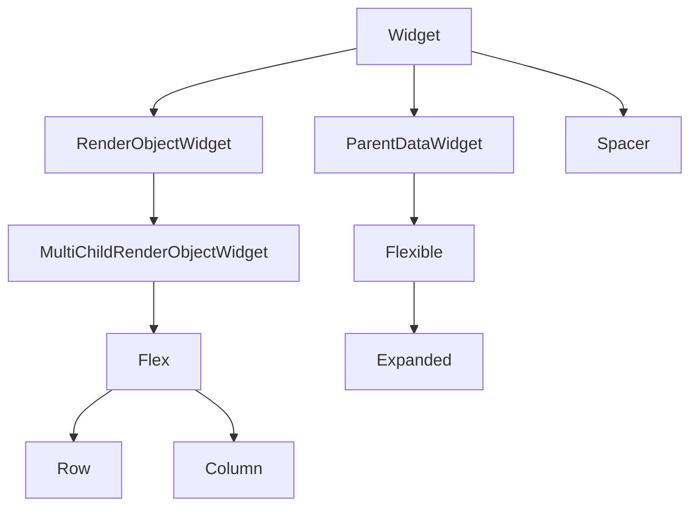

# Row, Column, and Flex

Linear layout is the backbone of Flutter UIs. Almost every screen is built from **rows** (horizontal groups) and **columns** (vertical stacks). Both inherit from **`Flex`**, which implements the flexbox model familiar from CSS.

## Class hierarchy

Understanding where widgets sit in the tree helps you predict layout behavior and read API docs faster.



| Class | Role |
|-------|------|
| `Widget` | Immutable configuration |
| `RenderObjectWidget` | Creates a `RenderObject` for layout/paint |
| `Flex` | Lays out children along a main axis |
| `Row` / `Column` | `Flex` with axis fixed to horizontal / vertical |
| `Flexible` | Attaches `FlexParentData` (flex factor, fit) to a child of `Flex` |
| `Expanded` | `Flexible` with `fit: FlexFit.tight` — must fill allocated space |
| `Spacer` | `Expanded` wrapping an empty `SizedBox` — absorbs free space |

`Row` and `Column` are thin wrappers:

```dart
// Conceptually equivalent to:
Row(...) => Flex(direction: Axis.horizontal, ...);
Column(...) => Flex(direction: Axis.vertical, ...);
```

## How Flex lays out children

1. The parent passes **constraints** to `Flex` (max width/height).
2. `Flex` lays out **non-flex** children at their intrinsic sizes (subject to constraints).
3. Remaining space along the **main axis** is divided among **`Flexible` / `Expanded`** children by `flex`.
4. Each child is positioned using **`mainAxisAlignment`** (along main axis) and **`crossAxisAlignment`** (perpendicular axis).

### Axes for Row and Column

| Widget | Main axis | Cross axis |
|--------|-----------|------------|
| `Row` | Horizontal (left → right in LTR) | Vertical |
| `Column` | Vertical (top → bottom) | Horizontal |

Use **`textDirection`** on `Row` when mirroring for RTL locales. **`verticalDirection`** on `Column` controls whether children grow downward (`down`) or upward (`up`).

## Flex constructor parameters

```dart
Flex({
  Key? key,
  Axis direction = Axis.horizontal,
  MainAxisAlignment mainAxisAlignment = MainAxisAlignment.start,
  MainAxisSize mainAxisSize = MainAxisSize.max,
  CrossAxisAlignment crossAxisAlignment = CrossAxisAlignment.center,
  TextDirection? textDirection,
  VerticalDirection verticalDirection = VerticalDirection.down,
  TextBaseline? textBaseline,
  Clip clipBehavior = Clip.none,
  List<Widget> children = const <Widget>[],
})
```

### mainAxisAlignment

Distributes free space **between** children along the main axis (after flex children take their share):

| Value | Effect |
|-------|--------|
| `start` | Pack children at the start |
| `end` | Pack at the end |
| `center` | Center the group |
| `spaceBetween` | First/last at edges; equal gaps between |
| `spaceAround` | Half-gap at ends; equal gaps between |
| `spaceEvenly` | Equal gaps including edges |

### mainAxisSize

- **`MainAxisSize.max`** (default) — `Row`/`Column` expands to the maximum width/height the parent allows.
- **`MainAxisSize.min`** — Shrink-wraps children on the main axis (useful inside scroll views or intrinsic layouts).

### crossAxisAlignment

| Value | Effect |
|-------|--------|
| `start` / `end` | Align to cross-axis start/end |
| `center` | Center on cross axis |
| `stretch` | Children are given tight cross-axis extent (e.g. full height in a `Row`) |
| `baseline` | Align text baselines (`textBaseline` required; only for `Row`) |

## Row — horizontal layouts

Typical **track row** pattern: leading icon, expanding title, trailing duration.

```dart
Row(
  crossAxisAlignment: CrossAxisAlignment.center,
  children: [
    const Icon(Icons.music_note, size: 20),
    const SizedBox(width: 12),
    Expanded(
      child: Column(
        crossAxisAlignment: CrossAxisAlignment.start,
        mainAxisSize: MainAxisSize.min,
        children: [
          Text(
            track.title,
            maxLines: 1,
            overflow: TextOverflow.ellipsis,
            style: Theme.of(context).textTheme.titleMedium,
          ),
          Text(
            track.artist,
            maxLines: 1,
            overflow: TextOverflow.ellipsis,
            style: Theme.of(context).textTheme.bodySmall,
          ),
        ],
      ),
    ),
    const SizedBox(width: 8),
    Text(track.durationLabel),
  ],
)
```

**Why `Expanded` on the title column?** A `Row` gives its children a **maximum width equal to the row width**. A `Text` without width bound tries to be as wide as one line of text — if several texts sit in one row, they can **overflow**. `Expanded` forces the middle section to take only the **remaining** width so `ellipsis` works.

### Toolbar row with spacer

```dart
Row(
  children: [
    const BackButton(),
    const Text('Now Playing'),
    const Spacer(), // flex: 1, expands
    IconButton(icon: const Icon(Icons.queue_music), onPressed: openQueue),
    IconButton(icon: const Icon(Icons.more_vert), onPressed: showMenu),
  ],
)
```

`Spacer` is sugar for `Expanded(child: SizedBox.shrink())`.

## Column — vertical layouts

```dart
Column(
  crossAxisAlignment: CrossAxisAlignment.stretch,
  children: [
    AspectRatio(
      aspectRatio: 1,
      child: Image.network(albumArtUrl, fit: BoxFit.cover),
    ),
    const SizedBox(height: 16),
    Text(albumTitle, style: Theme.of(context).textTheme.headlineSmall),
    Text(artistName, style: Theme.of(context).textTheme.bodyLarge),
    const SizedBox(height: 24),
    const PlaybackControls(),
  ],
)
```

`crossAxisAlignment: CrossAxisAlignment.stretch` makes children like buttons span the full width.

### Centered empty state in a Column

When the column should fill the screen but content stays centered:

```dart
Column(
  mainAxisAlignment: MainAxisAlignment.center,
  children: [
    Icon(Icons.library_music_outlined, size: 64, color: Colors.grey),
    const SizedBox(height: 16),
    const Text('Your library is empty'),
    const SizedBox(height: 8),
    FilledButton(onPressed: browseCatalog, child: const Text('Browse')),
  ],
)
```

## Expanded vs Flexible (preview)

Both must be **direct descendants** of `Row`, `Column`, or `Flex` (not nested inside another widget without a `Flex` ancestor).

```dart
Row(
  children: [
    Flexible(
      flex: 2,
      fit: FlexFit.loose,
      child: Text(longTitle, overflow: TextOverflow.ellipsis),
    ),
    Flexible(
      child: Text(shortLabel),
    ),
  ],
)
```

- **`Expanded`** = `Flexible(fit: FlexFit.tight)` — child **must** use all allocated flex space.
- **`Flexible(fit: FlexFit.loose)`** — child can be **smaller** than the allocation.

See Part 8 for edge cases and flex math.

## Common errors

| Symptom | Typical cause |
|---------|----------------|
| Yellow/black overflow stripes | `Row` child too wide (missing `Expanded` / `Flexible`) |
| `RenderFlex children have non-zero flex but incoming width constraints are unbounded` | `Column` with `Expanded` inside unbounded height (e.g. bare `Column` in `ListView` without shrink-wrap) |
| Unexpected vertical gaps | `CrossAxisAlignment.stretch` + tall children, or default `center` alignment |

**Fix for unbounded height:** Wrap the column in `Expanded` (inside `Column` parent), use `ListView` instead, or set `mainAxisSize: MainAxisSize.min`.

## Summary

`Flex` → `Row` / `Column` arrange children on one axis. Control distribution with `mainAxisAlignment`, cross-axis position with `crossAxisAlignment`, and sharing remaining space with `Expanded`, `Flexible`, and `Spacer`. Master the track-row pattern (`Icon` + `Expanded` + trailing metadata) — you will reuse it in lists, app bars, and player UIs throughout this book.
