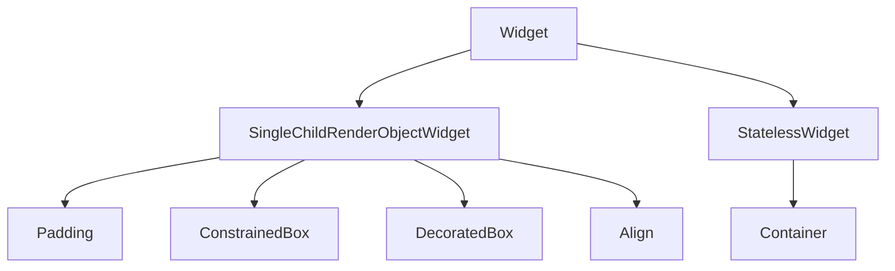

# Container, Padding, and Margin

Not every layout is a flex row. Often you need **insets**, **backgrounds**, **borders**, and **explicit sizes**. Flutter separates these concerns across several widgets; **`Container`** is a convenient **swiss-army** widget that composes many of them.

## Class hierarchy



`Container` is **not** a single render object. It builds a **chain** of simpler widgets depending on which properties you set:

| Properties set | Typical child chain (simplified) |
|----------------|----------------------------------|
| `padding` only | `Padding` |
| `color` / `decoration` | `DecoratedBox` (cannot use both `color` and `decoration`) |
| `constraints` | `ConstrainedBox` |
| `alignment` + single child | `Align` |
| `margin` | Outer `Padding` (margin is external padding) |
| `width` / `height` | `SizedBox` or tight constraints |

Prefer **`Padding`** and **`DecoratedBox`** directly when you only need one job — fewer layers, clearer intent.

## Padding

**`Padding`** inset around **one** child. It does not paint a background.

```dart
class Section extends StatelessWidget {
  const Section({super.key, required this.child});
  final Widget child;

  @override
  Widget build(BuildContext context) {
    return Padding(
      padding: const EdgeInsets.fromLTRB(16, 24, 16, 8),
      child: child,
    );
  }
}
```

### EdgeInsets variants

```dart
const EdgeInsets.all(16);
const EdgeInsets.symmetric(horizontal: 24, vertical: 12);
const EdgeInsets.only(left: 8, top: 4);
EdgeInsetsDirectional.only(start: 16, end: 8); // respects RTL
```

Use **`EdgeInsetsDirectional`** for start/end insets in international apps.

## Margin vs padding

| Concept | Flutter widget | Visual |
|---------|----------------|--------|
| **Padding** | Space **inside** the parent's border/background | Between border and child |
| **Margin** | Space **outside** the box | Between this widget and siblings |

`Container.margin` is implemented as **outer** `Padding` around the decorated/constrained child.

```dart
Container(
  margin: const EdgeInsets.symmetric(horizontal: 16, vertical: 8),
  padding: const EdgeInsets.all(12),
  decoration: BoxDecoration(
    color: Theme.of(context).colorScheme.surfaceContainerHighest,
    borderRadius: BorderRadius.circular(12),
  ),
  child: Row(
    children: [
      const CircleAvatar(child: Icon(Icons.person)),
      const SizedBox(width: 12),
      Expanded(child: Text('Playlist · 42 songs')),
    ],
  ),
)
```

## Container — full parameter tour

```dart
Container({
  Key? key,
  AlignmentGeometry? alignment,
  EdgeInsetsGeometry? padding,
  Color? color,
  Decoration? decoration,
  Decoration? foregroundDecoration,
  double? width,
  double? height,
  BoxConstraints? constraints,
  EdgeInsetsGeometry? margin,
  Matrix4? transform,
  AlignmentGeometry? transformAlignment,
  Clip clipBehavior = Clip.none,
  Widget? child,
})
```

### Rules and pitfalls

1. **`color` vs `decoration`** — Mutually exclusive on `Container`. For radius + color, use only `decoration: BoxDecoration(color: ...)`.
2. **`width` / `height`** — Apply tight dimensions when no other size logic conflicts.
3. **`constraints`** — Combine min/max width/height without fixing exact size:

```dart
Container(
  constraints: const BoxConstraints(minHeight: 48, maxWidth: 400),
  padding: const EdgeInsets.symmetric(horizontal: 16),
  alignment: Alignment.centerLeft,
  child: Text('Adaptive width bar'),
)
```

4. **`alignment`** — Positions **child** within the container when the container is larger than the child (often with explicit `width`/`height` or loose constraints).

### Card-like tile without `Card` widget

```dart
Container(
  clipBehavior: Clip.antiAlias,
  decoration: BoxDecoration(
    borderRadius: BorderRadius.circular(8),
    boxShadow: [
      BoxShadow(
        color: Colors.black.withValues(alpha: 0.2),
        blurRadius: 8,
        offset: const Offset(0, 2),
      ),
    ],
    image: DecorationImage(
      image: NetworkImage(coverUrl),
      fit: BoxFit.cover,
    ),
  ),
  width: 140,
  height: 140,
  child: Container(
    alignment: Alignment.bottomLeft,
    padding: const EdgeInsets.all(8),
    decoration: BoxDecoration(
      gradient: LinearGradient(
        begin: Alignment.topCenter,
        end: Alignment.bottomCenter,
        colors: [Colors.transparent, Colors.black.withValues(alpha: 0.7)],
      ),
    ),
    child: const Text('Daily Mix', style: TextStyle(color: Colors.white)),
  ),
)
```

## SizedBox — sized gap or fixed box

`SizedBox` is the lightweight alternative when you only need dimensions or spacing:

```dart
const SizedBox(width: 16);           // horizontal gap in Row
const SizedBox(height: 24);          // vertical gap in Column
SizedBox(width: 200, height: 48, child: ElevatedButton(...));
const SizedBox.expand();             // expand to max constraints
const SizedBox.shrink();             // zero size
```

In a `Row`, `SizedBox(width: n)` is clearer than `Padding` for fixed gaps.

## DecoratedBox and Padding composition

Explicit composition (same visual as many `Container` uses):

```dart
DecoratedBox(
  decoration: BoxDecoration(
    border: Border.all(color: Colors.grey.shade700),
    borderRadius: BorderRadius.circular(4),
  ),
  child: Padding(
    padding: const EdgeInsets.all(12),
    child: Text('Explicit widget chain'),
  ),
)
```

## ColoredBox and physical model

For a flat background without borders, **`ColoredBox`** is cheaper than `Container(color: ...)`:

```dart
ColoredBox(
  color: Theme.of(context).colorScheme.primaryContainer,
  child: const SizedBox(width: double.infinity, height: 4),
)
```


<!-- enriched:v3 -->

## Scenario

HarborCart product cards looked cramped until margin and padding were separated.

## Deep dive

Margin separates siblings; padding inset content. Prefer focused widgets over mega-Container.

## Extended example

```dart
Padding(
  padding: const EdgeInsets.all(12),
  child: DecoratedBox(
    decoration: BoxDecoration(
      borderRadius: BorderRadius.circular(16),
      color: const Color(0xFFF1F5F9),
    ),
    child: const ListTile(title: Text('Ceramic mug')),
  ),
);
```

## Refined UI note

Use 12–16dp outer margin rhythm between cards in grids.

## Try it

- Replace Container chain with Padding+DecoratedBox.
- Sketch margin vs padding.

## Summary

Use **`Padding`** for inset, **`SizedBox`** for fixed gaps and dimensions, and **`Container`** when you need decoration, alignment, margins, and constraints in one place. Remember: **margin** pushes siblings away; **padding** inset the child inside the box. Choosing focused widgets over a mega-`Container` keeps layout trees easier to debug.
