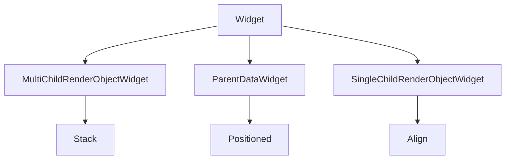

# Stack and Positioned

When widgets must **overlap** — album art with a gradient scrim, badges on avatars, or a mini-player above content — use **`Stack`**. Children paint in order: **first = back**, **last = front**.

## Class hierarchy



| Widget | Purpose |
|--------|---------|
| `Stack` | Overlays multiple children; sizes to fit all non-positioned children |
| `Positioned` | Sets `top` / `right` / `bottom` / `left` / `width` / `height` on a stack child |
| `Align` | Positions child by fraction or alignment inside stack (no absolute pixels) |
| `FractionallySizedBox` | Sizes child as fraction of stack |

`Positioned` only works as a **direct child** of `Stack` (same rule as `Expanded` in `Flex`).

## Stack parameters

```dart
Stack({
  Key? key,
  AlignmentGeometry alignment = AlignmentDirectional.topStart,
  TextDirection? textDirection,
  StackFit fit = StackFit.loose,
  Clip clipBehavior = Clip.hardEdge,
  List<Widget> children = const <Widget>[],
})
```

### StackFit

| Value | Behavior |
|-------|----------|
| `loose` | Stack sizes to contain non-positioned children; positioned children can extend outside |
| `expand` | Stack expands to max constraints from parent |
| `passthrough` | Passes parent constraints to stack sizing |

Use **`StackFit.expand`** when the stack should fill its parent (full-bleed cover art):

```dart
Stack(
  fit: StackFit.expand,
  children: [
    Image.network(heroUrl, fit: BoxFit.cover),
    const DecoratedBox(
      decoration: BoxDecoration(
        gradient: LinearGradient(
          begin: Alignment.topCenter,
          end: Alignment.bottomCenter,
          colors: [Colors.transparent, Colors.black87],
        ),
      ),
    ),
  ],
)
```

### alignment

Non-positioned children are aligned as a group using **`alignment`** (default top-start). Positioned children ignore this for their edges but still participate in stack size calculation.

## Positioned — absolute placement

```dart
Positioned({
  double? left,
  double? top,
  double? right,
  double? bottom,
  double? width,
  double? height,
  required Widget child,
})
```

Specify **at least two** of left/right/width or top/bottom/height to fully constrain the child, or use **`Positioned.fill`**:

```dart
Stack(
  children: [
    Image.asset('assets/playlist.png', fit: BoxFit.cover),
    Positioned(
      top: 8,
      right: 8,
      child: Container(
        padding: const EdgeInsets.symmetric(horizontal: 6, vertical: 2),
        decoration: BoxDecoration(
          color: Colors.black54,
          borderRadius: BorderRadius.circular(4),
        ),
        child: const Text('EXPLICIT', style: TextStyle(fontSize: 10, color: Colors.white)),
      ),
    ),
    const Positioned(
      left: 12,
      bottom: 12,
      right: 12,
      child: Text(
        'Chill Vibes',
        style: TextStyle(color: Colors.white, fontSize: 20, fontWeight: FontWeight.bold),
      ),
    ),
  ],
)
```

### Positioned.fill

Equivalent to `left: 0, top: 0, right: 0, bottom: 0` — common for overlays:

```dart
Stack(
  fit: StackFit.expand,
  children: [
    const FlutterLogo(),
    Positioned.fill(
      child: Material(
        color: Colors.black38,
        child: Center(
          child: IconButton(
            iconSize: 64,
            icon: const Icon(Icons.play_circle_fill, color: Colors.white),
            onPressed: onPlay,
          ),
        ),
      ),
    ),
  ],
)
```

## Align inside Stack

When you want **relative** placement without pixel offsets:

```dart
Stack(
  children: [
    const SizedBox(width: 200, height: 200, child: FlutterLogo()),
    Align(
      alignment: Alignment.bottomRight,
      child: Padding(
        padding: EdgeInsets.all(8),
        child: Icon(Icons.favorite, color: Colors.red),
      ),
    ),
  ],
)
```

`Align(alignment: Alignment(0.0, 0.5))` places using normalized coordinates from -1 to 1.

## IndexedStack — show one child, keep state

**`IndexedStack`** displays one child by index but **keeps all children alive** in the tree (useful for switching tabs without losing scroll position):

```dart
class PlayerBody extends StatelessWidget {
  const PlayerBody({super.key, required this.tabIndex});
  final int tabIndex;

  @override
  Widget build(BuildContext context) {
    return IndexedStack(
      index: tabIndex,
      children: const [
        LyricsView(),
        QueueView(),
        RelatedView(),
      ],
    );
  }
}
```

Hierarchy: `IndexedStack` extends `Stack` with `alignment` and `StackFit` similarly, but only paints the active index.

## Layered player artwork example

```dart
SizedBox(
  width: 280,
  height: 280,
  child: Stack(
    alignment: Alignment.center,
    children: [
      Container(
        width: 260,
        height: 260,
        decoration: BoxDecoration(
          shape: BoxShape.circle,
          boxShadow: [
            BoxShadow(blurRadius: 24, color: Colors.purple.withValues(alpha: 0.4)),
          ],
        ),
      ),
      ClipOval(
        child: Image.network(artUrl, width: 240, height: 240, fit: BoxFit.cover),
      ),
      if (isBuffering)
        const Positioned.fill(
          child: ColoredBox(
            color: Colors.black45,
            child: Center(child: CircularProgressIndicator()),
          ),
        ),
    ],
  ),
)
```

## clipBehavior

Overflowing stack children are clipped when `clipBehavior` is `hardEdge` or `antiAlias`. Set `Clip.none` only when intentional overflow (e.g. shadows) and you accept paint outside bounds.

## Summary

**`Stack`** layers widgets; **`Positioned`** pins children with edges; **`Align`** and **`FractionallySizedBox`** place by ratio. Use **`IndexedStack`** when switching visible panels without disposing off-screen state. Stacks are essential for media-rich UIs — covers, gradients, and play affordances on one surface.
