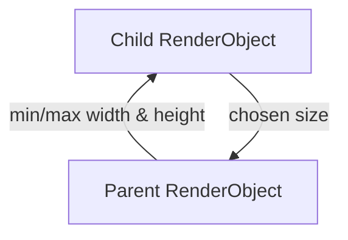
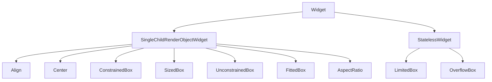

# Align, Center, and Constraints

Flutter layout is a **constraint negotiation**: parents pass `BoxConstraints` down; children pick a size and report it up. Widgets in this chapter **reshape constraints** or **position** a child within extra space — the tools you reach for when flex and stack are not enough.

## The constraint model (quick reference)



| Term | Meaning |
|------|---------|
| **Tight** constraints | min == max — child has exactly one legal size |
| **Loose** constraints | min is 0; max is finite — child can be any size up to max |
| **Unbounded** | max width or height is `double.infinity` — often an error for flex children |

Error messages like *"BoxConstraints forces an infinite width"* mean a child received unbounded constraints in a context that requires a finite size.

## Class hierarchy



| Widget | Primary job |
|--------|-------------|
| `Align` | Position child within parent; parent can be larger than child |
| `Center` | `Align(alignment: Alignment.center)` |
| `ConstrainedBox` | Adds min/max limits to constraints passed to child |
| `SizedBox` | Tight width/height (special case of constraints) |
| `UnconstrainedBox` | Loosens constraints (dangerous inside scrollables) |
| `FittedBox` | Scales child to fit |
| `AspectRatio` | Forces width:height ratio |
| `LimitedBox` | Max size when parent is unbounded (e.g. list children) |
| `OverflowBox` | Allows child to exceed parent max (with alignment) |

## Align and Center

```dart
Align({
  AlignmentGeometry alignment = Alignment.center,
  double? widthFactor,
  double? heightFactor,
  Widget? child,
})
```

- **`widthFactor` / `heightFactor`** — If set, `Align` sizes itself to child size × factor; otherwise expands to max constraint and positions child inside.

```dart
Align(
  alignment: Alignment.topRight,
  child: IconButton(
    icon: const Icon(Icons.close),
    onPressed: Navigator.of(context).pop,
  ),
)
```

**`Center`**:

```dart
Center(
  child: Column(
    mainAxisSize: MainAxisSize.min,
    children: [
      const CircularProgressIndicator(),
      const SizedBox(height: 16),
      Text('Loading catalog…'),
    ],
  ),
)
```

`Center` expands to fill the parent; the column shrink-wraps vertically (`mainAxisSize: min`).

## ConstrainedBox and SizedBox

**`ConstrainedBox`** merges additional constraints:

```dart
ConstrainedBox(
  constraints: const BoxConstraints(
    minWidth: 200,
    maxWidth: 480,
    minHeight: 48,
  ),
  child: TextField(decoration: const InputDecoration(hintText: 'Search songs')),
)
```

Common pattern: **readable line length** on desktop:

```dart
Center(
  child: ConstrainedBox(
    constraints: const BoxConstraints(maxWidth: 720),
    child: child,
  ),
)
```

**`SizedBox`** applies tight width/height when both are set:

```dart
const SizedBox(width: 100, height: 100, child: Placeholder());
```

## AspectRatio

Maintains **width / height** ratio; width is determined first from max width, then height derived:

```dart
AspectRatio(
  aspectRatio: 16 / 9,
  child: Image.network(bannerUrl, fit: BoxFit.cover),
)
```

Album grids often use `aspectRatio: 1` for square tiles.

## FittedBox

Scales and clips child to fit. **`BoxFit`** mirrors `Image` fit modes:

```dart
FittedBox(
  fit: BoxFit.scaleDown,
  child: Text(
    'LONG_ARTIST_NAME',
    style: TextStyle(fontSize: 48),
  ),
)
```

`scaleDown` only shrinks when needed; `fill` stretches (may distort).

## UnconstrainedBox, LimitedBox, OverflowBox

**`UnconstrainedBox`** — Child ignores parent max (still respects min). Use sparingly; can cause overflow upstream.

**`LimitedBox`** — When parent max is infinite (vertical `ListView` child), applies `maxWidth` default 1000 — prevents zero-width children:

```dart
ListView(
  children: images.map((url) => LimitedBox(
    maxHeight: 200,
    child: Image.network(url, fit: BoxFit.cover),
  )).toList(),
)
```

**`OverflowBox`** — Child may be **larger** than parent; useful for peek effects:

```dart
OverflowBox(
  maxHeight: 120,
  child: Image.network(coverUrl, height: 160, fit: BoxFit.cover),
)
```

## Reading layout errors

Example: *"RenderFlex overflowed by 42 pixels on the right."*

1. Identify the `Row` or `Column` in the error's widget chain.
2. Check for `Text` or `Row` children without `Expanded`.
3. Wrap with `Expanded`, `Flexible`, or allow scrolling (`ListView`).

Example: *"Vertical viewport was given unbounded height."*

- `ListView` inside `Column` without bounded height — wrap `ListView` in `Expanded` or use `shrinkWrap: true` with care.

## Putting it together — login-sized panel

```dart
Scaffold(
  body: Center(
    child: SingleChildScrollView(
      padding: const EdgeInsets.all(24),
      child: ConstrainedBox(
        constraints: const BoxConstraints(maxWidth: 400),
        child: Column(
          crossAxisAlignment: CrossAxisAlignment.stretch,
          children: [
            Text('Sign in', style: Theme.of(context).textTheme.headlineMedium),
            const SizedBox(height: 24),
            const TextField(decoration: InputDecoration(labelText: 'Email')),
            const SizedBox(height: 16),
            FilledButton(onPressed: () {}, child: const Text('Continue')),
          ],
        ),
      ),
    ),
  ),
)
```

`Center` → `ConstrainedBox` → `Column` is a standard responsive form shell.


<!-- enriched:v3 -->

## Scenario

LedgerAir empty states floated awkwardly because Column sat in unbounded height.

## Deep dive

Constraints flow down; sizes flow up. Center/Align position smaller children in larger boxes.

## Extended example

```dart
Center(
  child: ConstrainedBox(
    constraints: const BoxConstraints(maxWidth: 360),
    child: Column(
      mainAxisSize: MainAxisSize.min,
      children: const [Text('No entries yet'), SizedBox(height: 12), FilledButton(onPressed: null, child: Text('Import'))],
    ),
  ),
);
```

## Refined UI note

Constrain form width on desktop for readable line length.

## Try it

- Diagnose unbounded height error.
- Use AspectRatio for thumbnails.

## Summary

Parents pass constraints; **`ConstrainedBox`**, **`SizedBox`**, and **`AspectRatio`** shape what children may become; **`Align`** and **`Center`** position a smaller child in larger space. When layout breaks, read the constraint direction in the error — fixes are usually `Expanded`, bounded height, or `maxWidth` wrappers.
