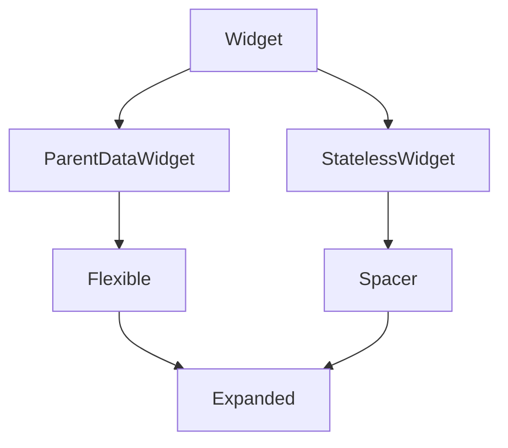

# Expanded and Flexible

Flex children that should **share leftover space** along the main axis use **`Flexible`** or **`Expanded`**. They are **`ParentDataWidget`s** — they do not render themselves; they attach **`FlexParentData`** (`flex`, `fit`) to a child of `Row`, `Column`, or `Flex`.

## Class hierarchy



| Class | `fit` | Size behavior |
|-------|-------|----------------|
| `Flexible` | `FlexFit.loose` (default) | Child ≤ flex allocation |
| `Flexible` | `FlexFit.tight` | Same as `Expanded` |
| `Expanded` | always `tight` | Child must fill allocation |
| `Spacer` | `Expanded` + empty box | Absorbs space for alignment |

Source relationship:

```dart
class Expanded extends Flexible {
  const Expanded({super.key, super.flex, required super.child})
      : super(fit: FlexFit.tight);
}
```

## Flex allocation algorithm (simplified)

Given a `Row` with max width **W**:

1. Layout **non-flex** children; sum their widths **S**.
2. Remaining **R = W - S** (if R < 0, overflow).
3. Sum flex factors **F** = sum of all `flex` on flex children.
4. Each flex child **i** gets **R × (flex_i / F)** main-axis space.
5. With **`FlexFit.tight`**, child must expand to that width. With **`loose`**, child can be narrower.

```dart
Row(
  children: [
    const Icon(Icons.album, size: 48),           // non-flex
    Expanded(                                    // flex: 1, tight
      flex: 3,
      child: Text(title, overflow: TextOverflow.ellipsis),
    ),
    Flexible(                                    // flex: 1, loose
      child: Text(
        '\$9.99',
        textAlign: TextAlign.end,
        overflow: TextOverflow.fade,
      ),
    ),
  ],
)
```

Here title gets **3/4** of remaining width; price gets **1/4** but may not need full width (`loose`).

## Expanded — when to use

Use **`Expanded`** when the child must **fill** its slot:

- `Text` with ellipsis in a `Row`
- `ListView` or `SingleChildScrollView` beside a sidebar in a `Row`
- Equal-width columns in a dashboard

```dart
Row(
  crossAxisAlignment: CrossAxisAlignment.start,
  children: [
    Expanded(child: _StatCard(label: 'Listeners', value: '12.4K')),
    const SizedBox(width: 12),
    Expanded(child: _StatCard(label: 'Tracks', value: '128')),
    const SizedBox(width: 12),
    Expanded(child: _StatCard(label: 'Hours', value: '842')),
  ],
)
```

### Column + Expanded

Inside a **`Column`** that has **bounded height** (e.g. inside `Scaffold` body `Expanded`):

```dart
Column(
  children: [
    const SearchBar(),
    Expanded(
      child: ListView.builder(
        itemCount: tracks.length,
        itemBuilder: (context, i) => TrackTile(track: tracks[i]),
      ),
    ),
    const MiniPlayerBar(),
  ],
)
```

Without **`Expanded`**, `ListView` in `Column` gets **unbounded height** → runtime error.

## Flexible — when loose fit matters

**`FlexFit.loose`** lets intrinsic-width children (chips, badges) take less than their flex share:

```dart
Row(
  children: [
    Flexible(
      child: Text(veryLongAlbumName, overflow: TextOverflow.ellipsis),
    ),
    const SizedBox(width: 8),
    Chip(label: Text(genre)), // non-flex, intrinsic width
  ],
)
```

Setting **`fit: FlexFit.tight`** on `Flexible` duplicates `Expanded`.

## Spacer

```dart
Row(
  children: [
    const Text('Volume'),
  const Spacer(flex: 2),
    Slider(value: 0.7, onChanged: (_) {}),
  ],
)
```

`Spacer(flex: n)` is `Expanded(flex: n, child: SizedBox.shrink())`.

## flex parameter

Default **`flex: 1`**. Higher values take proportionally more space:

```dart
Row(
  children: [
    Expanded(flex: 2, child: _ArtworkPanel()),
    Expanded(flex: 3, child: _TrackListPanel()),
  ],
)
```

Artwork 40%, list 60% of remaining width.

## Nested flex pitfalls

**Invalid:** `Expanded` inside `Expanded`'s child without an inner `Row`/`Column`:

```dart
// WRONG — Expanded must be direct child of Flex
Expanded(
  child: Padding(
    padding: const EdgeInsets.all(8),
    child: Expanded(child: Text('…')), // ERROR
  ),
)
```

**Valid:** Put flex widgets as direct children; wrap inner content with `Padding`:

```dart
Expanded(
  child: Padding(
    padding: const EdgeInsets.all(8),
    child: Text('…', overflow: TextOverflow.ellipsis),
  ),
)
```

## Flex vs Intrinsic layouts

Flex is **O(n)** and cheap. Do not wrap flex children in **`IntrinsicHeight`** unless necessary — intrinsic passes measure twice.


<!-- enriched:v3 -->

## Scenario

HarborCart split pane needed 2:3 ratio between filters and results.

## Deep dive

Flex divides remaining space; `Flexible` loosens fit when children shrink.

## Extended example

```dart
Row(
  children: [
    Flexible(flex: 2, child: FilterPanel()),
    Flexible(flex: 3, child: ResultsPanel()),
  ],
);
```

## Refined UI note

Use flex ratios instead of hard-coded pixel widths for resizable desktop layouts.

## Try it

- Convert rigid Row to flex.
- Explain tight vs loose fit.

## Summary

**`Expanded`** forces children to consume their flex share (**`FlexFit.tight`**). **`Flexible`** allows smaller children (**`loose`**). **`Spacer`** eats space for toolbars and sliders. Always place them as **direct** children of `Row`/`Column`, and bound height before putting scrollables in `Column`.
