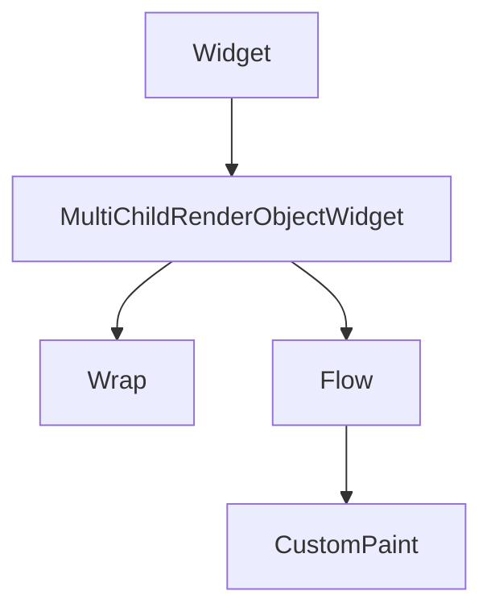

# Wrap and Flow Layout

When a **`Row`** cannot fit all children on one line, you get overflow. **`Wrap`** moves excess children to the **next run** (line or column), like CSS flex-wrap. For custom line breaking logic, **`Flow`** (with a delegate) offers lower-level control; most UIs use **`Wrap`**.

## Class hierarchy



| Widget | Use case |
|--------|----------|
| `Wrap` | Tags, filters, chip groups, keyword clouds |
| `Flow` | Custom placement (rare; complex delegates) |
| `Row` + horizontal `SingleChildScrollView` | Single line, scroll instead of wrap |

## Wrap parameters

```dart
Wrap({
  Axis direction = Axis.horizontal,
  WrapAlignment alignment = WrapAlignment.start,
  double spacing = 0.0,
  WrapAlignment runAlignment = WrapAlignment.start,
  double runSpacing = 0.0,
  WrapCrossAlignment crossAxisAlignment = WrapCrossAlignment.center,
  TextDirection? textDirection,
  VerticalDirection verticalDirection = VerticalDirection.down,
  Clip clipBehavior = Clip.none,
  List<Widget> children = const <Widget>[],
})
```

| Property | Meaning |
|----------|---------|
| `direction` | `horizontal` → runs left-to-right, wrap to next row; `vertical` → columns |
| `spacing` | Gap between children **on the same run** |
| `runSpacing` | Gap **between runs** (rows/columns) |
| `alignment` | How runs align along the main axis within `Wrap` width |
| `runAlignment` | How runs align along cross axis (vertical position of rows) |
| `crossAxisAlignment` | Align children within a run on cross axis |

## Genre filter chips

```dart
Wrap(
  spacing: 8,
  runSpacing: 8,
  children: genres.map((g) {
    final selected = g == selectedGenre;
    return FilterChip(
      label: Text(g),
      selected: selected,
      onSelected: (_) => onGenreSelected(g),
    );
  }).toList(),
)
```

## Comparison: Wrap vs Row vs ListView

| Pattern | Behavior | Best for |
|---------|----------|----------|
| `Row` | Single line, overflow if too wide | Toolbars, fixed few items |
| `Wrap` | Multi-line, no scroll | Tags, filters, small dynamic sets |
| `ListView` (horizontal) | Scroll one line | Many items, carousel |
| `GridView` | 2D grid with scroll | Album grids |

## Vertical Wrap

```dart
Wrap(
  direction: Axis.vertical,
  spacing: 4,
  runSpacing: 12,
  children: sideActions.map((icon) => IconButton(icon: icon, onPressed: () {})).toList(),
)
```

Rare on phones; occasionally used in landscape tool strips.

## Flow and FlowDelegate (overview)

**`Flow`** paints children with a **`FlowDelegate`** that computes position per child:

```dart
Flow(
  delegate: _PlaylistBubbleDelegate(),
  children: [
    for (final friend in listeningFriends)
      CircleAvatar(backgroundImage: NetworkImage(friend.avatarUrl)),
  ],
)
```

Delegates implement:

- `Size getSize(BoxConstraints constraints)` — flow size
- `void paintChildren(FlowPaintingContext context)` — position each child
- `bool shouldRepaint(covariant FlowDelegate oldDelegate)`

Use **`Flow`** when **`Wrap`** alignment is insufficient (e.g. staggered avatars along a path). Cost: more code and repaint logic.

## Wrap inside scroll views

A **`Wrap`** sizes to its content height. Inside **`Column`**, no `Expanded` needed:

```dart
SingleChildScrollView(
  padding: const EdgeInsets.all(16),
  child: Wrap(
    spacing: 8,
    runSpacing: 8,
    children: allMoods.map((m) => ActionChip(label: Text(m), onPressed: () {})).toList(),
  ),
)
```

If the wrap is inside unbounded height with thousands of chips, prefer paginated UI or `ListView` with custom delegate.

## Responsive filter bar

Combine **`LayoutBuilder`** with `Wrap` vs `Row`:

```dart
LayoutBuilder(
  builder: (context, constraints) {
    final chips = buildFilterChips();
    if (constraints.maxWidth < 400) {
      return Wrap(spacing: 8, runSpacing: 8, children: chips);
    }
    return Row(
      children: [
        ...chips.map((c) => Padding(padding: const EdgeInsets.only(right: 8), child: c)),
        const Spacer(),
        TextButton(onPressed: clearFilters, child: const Text('Clear')),
      ],
    );
  },
)
```


<!-- enriched:v3 -->

## Scenario

StudioBoard label editor overflowed when users added dozens of tags.

## Deep dive

Wrap moves children to next run instead of overflowing horizontally.

## Extended example

```dart
Wrap(spacing: 8, runSpacing: 8, children: tags.map((t) => Chip(label: Text(t))).toList());
```

## Refined UI note

Prefer Wrap for tag clouds; use horizontal ListView for intentionally scrollable single-line carousels.

## Try it

- Replace overflowing Row.
- Compare Wrap vs Grid.

## Summary

**`Wrap`** breaks flex lines when horizontal space runs out — ideal for chips and tags. Prefer **`Row` + scroll** for one long carousel, **`GridView`** for large 2D catalogs, and **`Flow`** only when you need custom child positioning beyond wrap rules.
