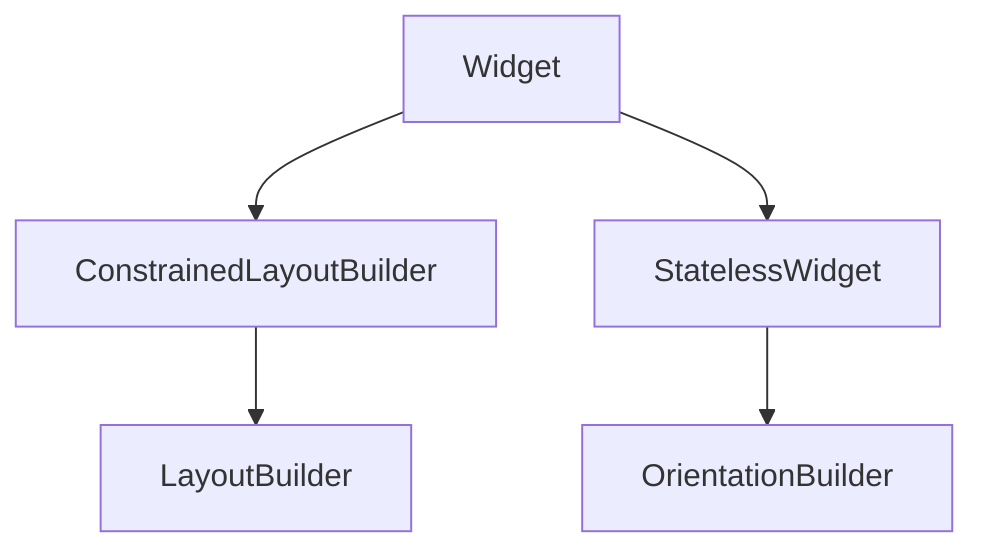

# LayoutBuilder

**`MediaQuery`** tells you screen size; **`LayoutBuilder`** tells you **how much space your parent actually offers** — which may be smaller than the screen (dialogs, split panes, `NavigationRail` content area).

## Class hierarchy



| Widget | Callback receives |
|--------|-------------------|
| `LayoutBuilder` | `BoxConstraints` from parent |
| `OrientationBuilder` | `Orientation` (portrait/landscape) from `MediaQuery` |

`LayoutBuilder` extends **`ConstrainedLayoutBuilder<BoxConstraints>`** — same pattern as sliver variants in custom scroll views.

## API

```dart
LayoutBuilder({
  Key? key,
  required Widget Function(BuildContext context, BoxConstraints constraints) builder,
})
```

The **`builder`** runs during layout. **Do not** cache `constraints` across frames outside `build` without listening to layout changes — rebuild when parent resizes.

### Reading constraints

```dart
LayoutBuilder(
  builder: (context, constraints) {
    final maxW = constraints.maxWidth;
    final maxH = constraints.maxHeight;
    final minW = constraints.minWidth;
    final hasBoundedHeight = constraints.hasBoundedHeight;
    final hasBoundedWidth = constraints.hasBoundedWidth;

    if (maxW >= 900) {
      return const DesktopLibraryLayout();
    }
    if (maxW >= 600) {
      return const TabletLibraryLayout();
    }
    return const PhoneLibraryLayout();
  },
)
```

Breakpoints should reflect **your** design, not arbitrary device names.

## Why not MediaQuery alone?

```dart
// Parent leaves only 360px for content beside a 280px rail:
Row(
  children: [
    const NavigationRail(...), // fixed width
    Expanded(
      child: LayoutBuilder(
        builder: (context, constraints) {
          // constraints.maxWidth ≈ screenWidth - rail - dividers
          return constraints.maxWidth > 500
              ? const TwoColumnTrackList()
              : const SingleColumnTrackList();
        },
      ),
    ),
  ],
)
```

`MediaQuery.sizeOf(context).width` would still report full screen width.

## Responsive album grid

```dart
LayoutBuilder(
  builder: (context, constraints) {
    const minTile = 140.0;
    const spacing = 12.0;
    final count = ((constraints.maxWidth + spacing) / (minTile + spacing)).floor().clamp(2, 6);
    return GridView.builder(
      padding: const EdgeInsets.all(spacing),
      gridDelegate: SliverGridDelegateWithFixedCrossAxisCount(
        crossAxisCount: count,
        crossAxisSpacing: spacing,
        mainAxisSpacing: spacing,
        childAspectRatio: 0.85,
      ),
      itemCount: albums.length,
      itemBuilder: (context, index) => AlbumCard(album: albums[index]),
    );
  },
)
```

Column count adapts to **available** width, not device type.

## LayoutBuilder inside scrollables

If parent gives **unbounded height** (vertical `ListView` child), `constraints.maxHeight` is infinite. Branch carefully:

```dart
LayoutBuilder(
  builder: (context, constraints) {
    if (!constraints.hasBoundedHeight) {
      return const SizedBox(height: 200, child: Placeholder());
    }
    return SizedBox(
      height: constraints.maxHeight * 0.3,
      child: const NowPlayingBanner(),
    );
  },
)
```

Prefer giving bounded height from ancestor (`SizedBox`, `AspectRatio`, `Expanded`).

## OrientationBuilder

```dart
OrientationBuilder(
  builder: (context, orientation) {
    if (orientation == Orientation.landscape) {
      return const Row(
        children: [
          Expanded(flex: 2, child: ArtworkPane()),
          Expanded(flex: 3, child: QueuePane()),
        ],
      );
    }
    return const Column(
      children: [
        ArtworkPane(),
        Expanded(child: QueuePane()),
      ],
    );
  },
)
```

Orientation can change without window resize on foldables — combine with `LayoutBuilder` when needed.

## Performance note

`builder` runs every layout pass. Keep work cheap; avoid heavy computation or I/O. For complex trees, extract stable subtrees with `const` constructors where possible.

## Summary

**`LayoutBuilder`** exposes parent **`BoxConstraints`** for adaptive layouts inside split views and resizable windows. Use it with **`OrientationBuilder`** when axis matters. Prefer constraint-based breakpoints over hard-coded device lists.
