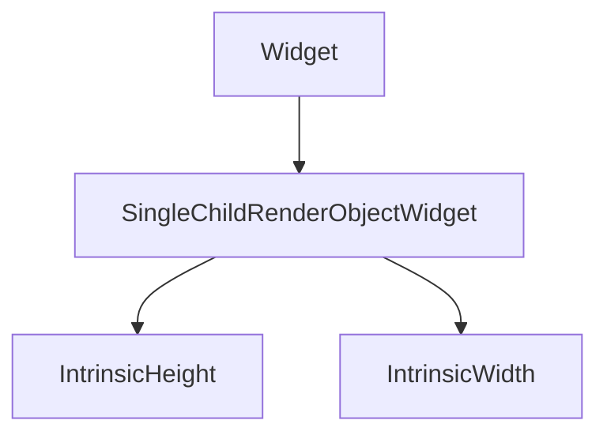
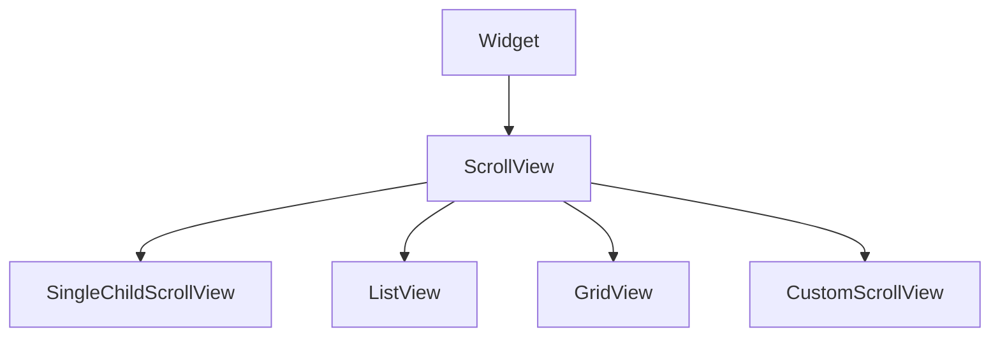
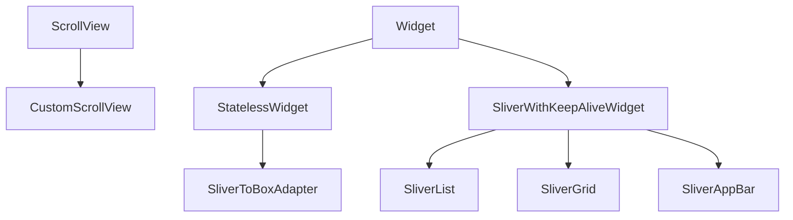

# Intrinsic Dimensions and Slivers

Some layouts need **child-driven cross-axis sizing** (`IntrinsicHeight`) or **coordinated scrolling** with collapsing headers (**slivers**). These APIs are powerful and costlier than simple flex — use them deliberately.

## Part A — Intrinsic dimensions

### Class hierarchy



| Widget | Behavior |
|--------|----------|
| `IntrinsicHeight` | Child row/column children get equal **height** = max intrinsic height |
| `IntrinsicWidth` | Symmetric for width |

Intrinsic layouts run **extra measure passes** — documentation warns to avoid in deep lists.

### Equal-height cards in a Row

```dart
IntrinsicHeight(
  child: Row(
    crossAxisAlignment: CrossAxisAlignment.stretch,
    children: [
      Expanded(child: _ PromoCard(title: 'New Release', body: shortText)),
      const SizedBox(width: 12),
      Expanded(child: _PromoCard(title: 'Podcast', body: muchLongerDescription)),
    ],
  ),
)
```

Without `IntrinsicHeight`, `CrossAxisAlignment.stretch` only works if the row has a **defined height**. Intrinsic height computes the tallest child first.

### When to avoid

- Long `ListView` items — use fixed `height` or `AspectRatio` instead.
- Deep widget trees — measure cost multiplies.

## Part B — ScrollView basics

### Class hierarchy (single-child scroll)



| Widget | Child model |
|--------|-------------|
| `SingleChildScrollView` | One child; scroll when larger than viewport |
| `ListView` | Linear list of children or builder |
| `GridView` | 2D grid |
| `CustomScrollView` | List of **slivers** |

**`ScrollView`** subclasses share: `controller`, `physics`, `padding`, `scrollDirection`, `reverse`, `primary`.

```dart
SingleChildScrollView(
  padding: const EdgeInsets.all(16),
  child: Column(
    crossAxisAlignment: CrossAxisAlignment.stretch,
    children: [
      const HeroBanner(),
      const SizedBox(height: 24),
      ...sections.map((s) => SectionBlock(section: s)),
    ],
  ),
)
```

Use when content is **one column** and not enormous. For hundreds of rows, use **`ListView.builder`**.

## Part C — Sliver protocol

### Hierarchy



A **sliver** is a slice of scrollable content with lazy layout. **`CustomScrollView`** stitches slivers into **one** scrollable — one physics, one `ScrollController`.

### Core sliver widgets

| Widget | Role |
|--------|------|
| `SliverAppBar` | Collapsing/pinned app bar |
| `SliverList` / `SliverList.builder` | Lazy linear list |
| `SliverGrid` / `SliverGrid.builder` | Lazy grid |
| `SliverToBoxAdapter` | Single box widget (banner, header) |
| `SliverPadding` | Insets around another sliver |
| `SliverPersistentHeader` | Pinned section headers (custom delegate) |
| `NestedScrollView` | Coordinated outer/inner scroll (e.g. tab + list) |

### Browse screen example

```dart
CustomScrollView(
  slivers: [
    SliverAppBar(
      expandedHeight: 200,
      pinned: true,
      flexibleSpace: FlexibleSpaceBar(
        title: const Text('Good evening'),
        background: Stack(
          fit: StackFit.expand,
          children: [
            Image.network(heroUrl, fit: BoxFit.cover),
            const DecoratedBox(
              decoration: BoxDecoration(
                gradient: LinearGradient(
                  begin: Alignment.topCenter,
                  end: Alignment.bottomCenter,
                  colors: [Colors.transparent, Colors.black54],
                ),
              ),
            ),
          ],
        ),
      ),
    ),
    SliverPadding(
      padding: const EdgeInsets.all(16),
      sliver: SliverToBoxAdapter(
        child: Text('Made for you', style: Theme.of(context).textTheme.titleLarge),
      ),
    ),
    SliverPadding(
      padding: const EdgeInsets.symmetric(horizontal: 16),
      sliver: SliverGrid.builder(
        gridDelegate: const SliverGridDelegateWithMaxCrossAxisExtent(
          maxCrossAxisExtent: 180,
          mainAxisSpacing: 12,
          crossAxisSpacing: 12,
          childAspectRatio: 0.8,
        ),
        itemCount: playlists.length,
        itemBuilder: (context, index) => PlaylistCard(playlist: playlists[index]),
      ),
    ),
    SliverList.builder(
      itemCount: recentTracks.length,
      itemBuilder: (context, index) => ListTile(
        title: Text(recentTracks[index].title),
        subtitle: Text(recentTracks[index].artist),
      ),
    ),
  ],
)
```

### SliverAppBar modes

| Property | Effect |
|----------|--------|
| `pinned: true` | Toolbar stays visible when collapsed |
| `floating: true` | Bar reappears when scrolling down |
| `snap: true` | Snaps open/closed (requires `floating`) |
| `expandedHeight` | Height when fully expanded |

### Mixing box widgets

Never put a raw `Column` directly in `CustomScrollView`. Wrap with **`SliverToBoxAdapter`** or use sliver variants.

```dart
// WRONG
CustomScrollView(slivers: [Column(children: [...])]);

// RIGHT
CustomScrollView(
  slivers: [
    SliverToBoxAdapter(child: Column(mainAxisSize: MainAxisSize.min, children: [...])),
  ],
);
```

## NestedScrollView (brief)

For **tab bar under collapsing header** + tab bodies that scroll:

```dart
NestedScrollView(
  headerSliverBuilder: (context, innerBoxIsScrolled) => [
    const SliverAppBar(title: Text('Artist'), pinned: true),
    SliverPersistentHeader(
      pinned: true,
      delegate: _TabBarDelegate(tabBar: TabBar(tabs: tabs)),
    ),
  ],
  body: TabBarView(
    children: [
      AlbumsTab(),
      AboutTab(),
    ],
  ),
)
```


<!-- enriched:v3 -->

## Scenario

HarborCart marketing page needs collapsing hero plus product list in one scroll.

## Deep dive

CustomScrollView unifies slivers; avoid nesting scroll views fighting for gestures.

## Extended example

```dart
CustomScrollView(
  slivers: [
    const SliverAppBar(expandedHeight: 180, pinned: true, flexibleSpace: FlexibleSpaceBar(title: Text('Sale'))),
    SliverList.builder(itemCount: 20, itemBuilder: (c, i) => ListTile(title: Text('Item $i'))),
  ],
);
```

## Refined UI note

Pair floating SliverAppBar with list top padding so first item is not hidden.

## Try it

- Add SliverGrid section.
- Explain intrinsic measure cost.

## Summary

**`IntrinsicHeight` / `IntrinsicWidth`** align flex children on intrinsic max size — use for small rows, not long lists. **`CustomScrollView` + slivers** unify scrolling with collapsing app bars and lazy grids — the standard pattern for media browse screens. Prefer **`SliverList.builder`** over giant `Column` in scroll views for performance.
