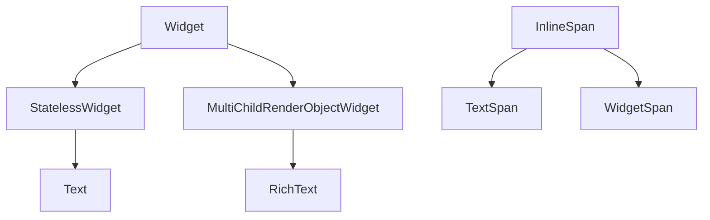
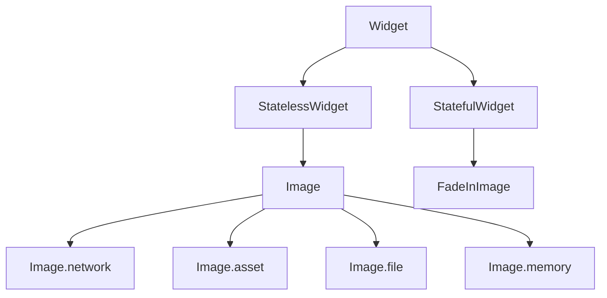

# Text and Images

Typography and imagery carry most of the visual identity in a music app — titles, metadata, album art, and icons. Flutter separates **text layout** (`Text`, `RichText`) from **raster/vector imagery** (`Image`, `Icon`).

## Text — class hierarchy



| Class | Role |
|-------|------|
| `Text` | Convenience wrapper: one string + `TextStyle` / `style` from theme |
| `RichText` | Lays out an `InlineSpan` tree (multiple styles, links) |
| `TextSpan` | Styled substring; can nest children |
| `WidgetSpan` | Embeds a widget inline (rare) |
| `DefaultTextStyle` | Inherited style for descendant `Text` without explicit style |

`Text` implementation (conceptually): merges `DefaultTextStyle`, `style`, and `data` into `RichText`.

## Text — parameters and usage

```dart
Text(
  'Bohemian Rhapsody',
  style: Theme.of(context).textTheme.titleLarge?.copyWith(
    fontWeight: FontWeight.w600,
  ),
  maxLines: 1,
  overflow: TextOverflow.ellipsis,
  softWrap: true,
  textAlign: TextAlign.start,
  semanticsLabel: 'Track title: Bohemian Rhapsody',
)
```

| Property | Purpose |
|----------|---------|
| `style` | `TextStyle` (font, size, color, letterSpacing, height) |
| `maxLines` | Clamp lines; with `overflow` for truncation |
| `overflow` | `ellipsis`, `fade`, `clip`, `visible` |
| `textScaler` / inherit from `MediaQuery` | Respect user accessibility text scale |
| `selectionColor` | When inside `SelectableText` |

### Theme text styles

```dart
final textTheme = Theme.of(context).textTheme;
Text('Artist', style: textTheme.bodyMedium);
Text('Album', style: textTheme.labelSmall?.copyWith(color: Colors.grey));
```

Material 3 exposes `displayLarge` … `labelSmall`. Stay on theme roles instead of hard-coded font sizes.

### RichText and TextSpan

```dart
RichText(
  text: TextSpan(
    style: DefaultTextStyle.of(context).style,
    children: [
      TextSpan(
        text: 'Premium ',
        style: TextStyle(color: Theme.of(context).colorScheme.primary),
      ),
      const TextSpan(text: '· Ad-free listening'),
    ],
  ),
)
```

Always set a base `style` on the root `TextSpan` — undefined color may become yellow underline (missing material ancestor).

### SelectableText

For lyrics or copyable URLs:

```dart
SelectableText(
  lyrics,
  style: Theme.of(context).textTheme.bodyLarge,
  showCursor: true,
)
```

## Icon

**`Icon`** displays a glyph from an **`IconData`** font (Material Icons by default):

```dart
Icon(
  Icons.shuffle,
  size: 24,
  color: Theme.of(context).colorScheme.onSurfaceVariant,
  semanticLabel: 'Shuffle playback order',
)
```

| Related | Use |
|---------|-----|
| `IconButton` | Tappable icon with minimum touch target |
| `ImageIcon` | Icon from `AssetImage` |

## Image — class hierarchy



`Image` is a **`StatelessWidget`** that configures an **`ImageStream`** via a provider:

| Constructor | Provider |
|-------------|----------|
| `Image.asset` | `AssetImage` |
| `Image.network` | `NetworkImage` |
| `Image.file` | `FileImage` |
| `Image.memory` | `MemoryImage` |

### Image.asset

Declare in `pubspec.yaml`:

```yaml
flutter:
  assets:
    - assets/images/
```

```dart
Image.asset(
  'assets/images/default_cover.png',
  width: 64,
  height: 64,
  fit: BoxFit.cover,
  cacheWidth: 128, // decode smaller for memory
)
```

### Image.network

```dart
Image.network(
  track.artUrl!,
  width: 300,
  height: 300,
  fit: BoxFit.cover,
  loadingBuilder: (context, child, loadingProgress) {
    if (loadingProgress == null) return child;
    return const Center(child: CircularProgressIndicator());
  },
  errorBuilder: (context, error, stackTrace) {
    return Container(
      color: Colors.grey.shade800,
      child: const Icon(Icons.broken_image_outlined),
    );
  },
)
```

Always provide **`errorBuilder`** for CDN failures. Use **`loadingBuilder`** or placeholder widgets for slow networks.

### BoxFit

| Value | Behavior |
|-------|----------|
| `cover` | Fill bounds; crop overflow |
| `contain` | Fit inside; letterbox |
| `fill` | Stretch to bounds |
| `fitWidth` / `fitHeight` | Fit one axis |
| `scaleDown` | Like contain but never upscale |

Album squares typically use **`BoxFit.cover`** inside `ClipRRect` or `ClipOval`.

### FadeInImage

```dart
FadeInImage.assetNetwork(
  placeholder: 'assets/images/placeholder.png',
  image: album.artUrl,
  fit: BoxFit.cover,
  imageErrorBuilder: (_, __, ___) => const Icon(Icons.album),
)
```

### ClipRRect with images

```dart
ClipRRect(
  borderRadius: BorderRadius.circular(8),
  child: Image.network(url, width: 120, height: 120, fit: BoxFit.cover),
)
```

## CircleAvatar

Combines circular clip + optional background image:

```dart
CircleAvatar(
  radius: 20,
  backgroundImage: NetworkImage(user.avatarUrl),
  onBackgroundImageError: (_, __) {},
  child: user.avatarUrl == null ? const Icon(Icons.person) : null,
)
```

## Production note: cached_network_image

The package **`cached_network_image`** adds disk/memory cache and fade — recommended for long lists of album art.

## Summary

Use **`Text`** with theme styles and ellipsis for dense lists; **`RichText`** for mixed styles. Load images via **`Image.asset`** / **`Image.network`** with **`fit`**, **`errorBuilder`**, and optional **`cacheWidth`**. **`Icon`** covers symbolic actions; **`CircleAvatar`** covers user/artist thumbnails.
