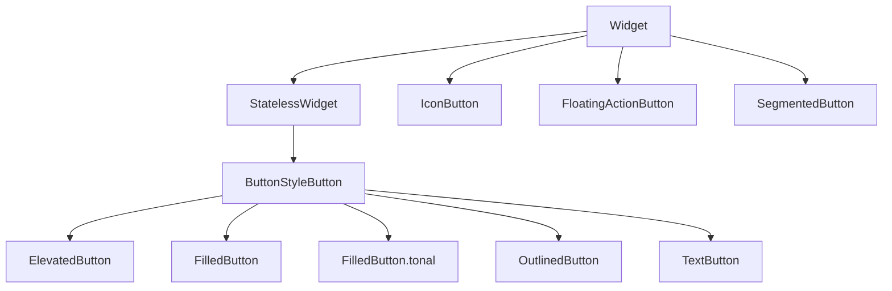

# Buttons

Buttons communicate **actions**. Material 3 defines a **hierarchy of emphasis** — one primary action per region, secondary actions less prominent, destructive actions clearly signaled.

## Class hierarchy (Material 3)



| Widget | Emphasis | Typical use |
|--------|----------|-------------|
| `FilledButton` | Highest | Primary CTA: Play, Subscribe |
| `FilledButton.tonal` | Medium-high | Important but not primary |
| `ElevatedButton` | Medium (M2 carryover) | Legacy; prefer Filled in M3 |
| `OutlinedButton` | Medium-low | Secondary: Cancel, Filter |
| `TextButton` | Low | Tertiary: Learn more, Dismiss |
| `IconButton` | Icon-only | Toolbar, player controls |
| `FloatingActionButton` | Prominent single action | Create playlist |
| `SegmentedButton` | Toggle group | Shuffle / Repeat modes |

All **`ButtonStyleButton`** subclasses share:

```dart
onPressed: VoidCallback?,  // null = disabled
onLongPress: VoidCallback?,
style: ButtonStyle?,
focusNode: FocusNode?,
autofocus: bool,
clipBehavior: Clip,
child: Widget,  // or label + icon via *.icon constructors
```

**`onPressed: null`** disables the button and applies disabled styling from the theme.

## FilledButton

```dart
FilledButton(
  onPressed: isPremium ? null : upgradeToPremium,
  child: const Text('Get Premium'),
)

FilledButton.icon(
  onPressed: _playAlbum,
  icon: const Icon(Icons.play_arrow),
  label: const Text('Play'),
)
```

## OutlinedButton and TextButton

```dart
Row(
  children: [
    OutlinedButton(
      onPressed: () => Navigator.pop(context),
      child: const Text('Cancel'),
    ),
    const SizedBox(width: 12),
    FilledButton(
      onPressed: _savePlaylist,
      child: const Text('Save'),
    ),
  ],
)

TextButton(
  onPressed: showTerms,
  child: const Text('Terms apply'),
)
```

## IconButton

```dart
IconButton(
  icon: const Icon(Icons.favorite_border),
  selectedIcon: const Icon(Icons.favorite),
  isSelected: isLiked,
  tooltip: 'Save to library',
  onPressed: toggleLike,
)

IconButton.filled(
  onPressed: previousTrack,
  icon: const Icon(Icons.skip_previous),
)
```

| Variant | Visual |
|---------|--------|
| `IconButton` | Standard |
| `IconButton.filled` | Filled background |
| `IconButton.filledTonal` | Tonal fill |
| `IconButton.outlined` | Outlined |

Use **`tooltip`** on desktop (hover) and for accessibility.

## FloatingActionButton

```dart
FloatingActionButton.extended(
  onPressed: createPlaylist,
  icon: const Icon(Icons.add),
  label: const Text('Playlist'),
)
```

`Scaffold.floatingActionButton` positions FAB; `floatingActionButtonLocation` adjusts corner.

## SegmentedButton

```dart
enum RepeatMode { off, all, one }

SegmentedButton<RepeatMode>(
  segments: const [
    ButtonSegment(value: RepeatMode.off, label: Text('Off')),
    ButtonSegment(value: RepeatMode.all, icon: Icon(Icons.repeat)),
    ButtonSegment(value: RepeatMode.one, icon: Icon(Icons.repeat_one)),
  ],
  selected: {repeatMode},
  onSelectionChanged: (Set<RepeatMode> selected) {
    setState(() => repeatMode = selected.first);
  },
)
```

## ButtonStyle and Theme

Override per widget or globally:

```dart
FilledButton(
  style: FilledButton.styleFrom(
    minimumSize: const Size.fromHeight(48),
    padding: const EdgeInsets.symmetric(horizontal: 24),
    shape: RoundedRectangleBorder(borderRadius: BorderRadius.circular(24)),
  ),
  onPressed: () {},
  child: const Text('Rounded CTA'),
)
```

```dart
ThemeData(
  filledButtonTheme: FilledButtonThemeData(
    style: FilledButton.styleFrom(
      backgroundColor: Colors.greenAccent,
      foregroundColor: Colors.black,
    ),
  ),
)
```

## Cupertino buttons (iOS style)

```dart
import 'package:flutter/cupertino.dart';

CupertinoButton(
  onPressed: play,
  child: const Text('Play'),
)

CupertinoButton.filled(onPressed: play, child: const Text('Play'))
```

Use **`Switch.adaptive`**, **`Slider.adaptive`** similarly for platform feel.

## Player control row example

```dart
Row(
  mainAxisAlignment: MainAxisAlignment.center,
  children: [
    IconButton(icon: const Icon(Icons.shuffle), onPressed: toggleShuffle),
    IconButton(icon: const Icon(Icons.skip_previous), onPressed: previous),
    FilledButton(
      style: FilledButton.styleFrom(
        shape: const CircleBorder(),
        padding: const EdgeInsets.all(16),
      ),
      onPressed: togglePlayPause,
      child: Icon(isPlaying ? Icons.pause : Icons.play_arrow),
    ),
    IconButton(icon: const Icon(Icons.skip_next), onPressed: next),
    IconButton(icon: const Icon(Icons.repeat), onPressed: cycleRepeat),
  ],
)
```

## Accessibility

- Buttons need a visible label or **`tooltip`** / `Semantics(label: ...)`.
- Minimum touch target 48×48 logical pixels (`minimumSize` on styles).
- Disabled actions: `onPressed: null`, not invisible widgets.

## Summary

Pick **`FilledButton`** for primary actions, **`OutlinedButton`** / **`TextButton`** for secondary, **`IconButton`** for compact toolbars. Control state with **`onPressed`**, appearance with **`ButtonStyle`** and theme. Match platform expectations with **Cupertino** variants when building adaptive apps.
