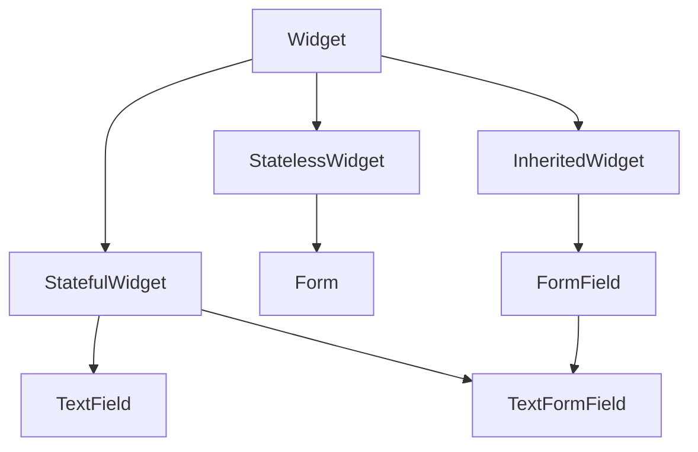

# Text Fields

Search, login, playlist naming, and lyrics editing all need **text input**. Flutter provides **`TextField`** (standalone) and **`TextFormField`** (integrated with **`Form`** validation).

## Class hierarchy



| Widget | Role |
|--------|------|
| `TextField` | Low-level editable text; no built-in form validation |
| `TextFormField` | Wraps `TextField`; reports value/errors to `FormState` |
| `Form` | Groups fields; `save`, `validate`, `reset` |
| `InputDecoration` | Border, labels, icons, hints around the field |
| `TextEditingController` | Imperative read/write of text and selection |

Both fields delegate painting to **`EditableText`** → **`RenderEditable`**.

## TextField — core API

```dart
final _searchController = TextEditingController();

TextField(
  controller: _searchController,
  focusNode: _focusNode,
  decoration: const InputDecoration(
    labelText: 'Search songs, artists, albums',
    hintText: 'Try "jazz"',
    prefixIcon: Icon(Icons.search),
    suffixIcon: Icon(Icons.mic),
    border: OutlineInputBorder(),
    filled: true,
  ),
  keyboardType: TextInputType.text,
  textInputAction: TextInputAction.search,
  autocorrect: false,
  enableSuggestions: true,
  maxLines: 1,
  onChanged: (value) => debouncer.run(() => search(value)),
  onSubmitted: (value) => search(value),
)
```

| Property | Purpose |
|----------|---------|
| `obscureText` | Password dots |
| `readOnly` | Display-only; tap opens picker |
| `enabled` | Grayed out when false |
| `maxLength` | Character limit + counter |
| `inputFormatters` | Masking, digits only |
| `style` | Typed text appearance |
| `cursorColor` | Caret color |

### Dispose controllers

```dart
@override
void dispose() {
  _searchController.dispose();
  _focusNode.dispose();
  super.dispose();
}
```

## InputDecoration

```dart
InputDecoration(
  labelText: 'Playlist name',
  floatingLabelBehavior: FloatingLabelBehavior.auto,
  helperText: 'Visible to followers',
  errorText: nameError,
  prefixIcon: Icon(Icons.queue_music),
  suffix: Text('${name.length}/50'),
  contentPadding: EdgeInsets.symmetric(horizontal: 16, vertical: 12),
  border: OutlineInputBorder(borderRadius: BorderRadius.circular(12)),
  enabledBorder: OutlineInputBorder(
    borderSide: BorderSide(color: Colors.grey.shade700),
  ),
  focusedBorder: OutlineInputBorder(
    borderSide: BorderSide(color: Theme.of(context).colorScheme.primary, width: 2),
  ),
)
```

Use **`InputDecorationTheme`** in `ThemeData` for app-wide search bars.

### Search bar styling (filled, rounded)

```dart
TextField(
  decoration: InputDecoration(
    hintText: 'Search',
    prefixIcon: const Icon(Icons.search),
    filled: true,
    fillColor: Theme.of(context).colorScheme.surfaceContainerHighest,
    border: OutlineInputBorder(
      borderRadius: BorderRadius.circular(28),
      borderSide: BorderSide.none,
    ),
  ),
)
```

## TextFormField and Form

```dart
final _formKey = GlobalKey<FormState>();

Form(
  key: _formKey,
  autovalidateMode: AutovalidateMode.onUserInteraction,
  child: Column(
    children: [
      TextFormField(
        decoration: const InputDecoration(labelText: 'Email'),
        keyboardType: TextInputType.emailAddress,
        validator: (value) {
          if (value == null || !value.contains('@')) return 'Enter a valid email';
          return null;
        },
        onSaved: (value) => email = value!,
      ),
      const SizedBox(height: 16),
      TextFormField(
        decoration: const InputDecoration(labelText: 'Password'),
        obscureText: true,
        validator: (value) {
          if (value == null || value.length < 8) return 'At least 8 characters';
          return null;
        },
      ),
      FilledButton(
        onPressed: () {
          if (_formKey.currentState!.validate()) {
            _formKey.currentState!.save();
            submit();
          }
        },
        child: const Text('Sign in'),
      ),
    ],
  ),
)
```

| Method | Action |
|--------|--------|
| `validate()` | Runs all validators; returns false if any error |
| `save()` | Calls `onSaved` on fields |
| `reset()` | Clears fields to initial values |

## Focus and keyboard

```dart
FocusScope.of(context).unfocus(); // dismiss keyboard

TextField(
  focusNode: focusNode,
  onTapOutside: (_) => focusNode.unfocus(),
)
```

`textInputAction: TextInputAction.next` + `FocusNode.requestFocus()` chains fields.

## readOnly + onTap (picker pattern)

```dart
TextField(
  readOnly: true,
  controller: TextEditingController(text: selectedDateLabel),
  decoration: const InputDecoration(labelText: 'Release date'),
  onTap: () async {
    final date = await showDatePicker(...);
    if (date != null) setState(() => ...);
  },
)
```

## Debounced search (pattern)

Do not call API on every keystroke in `onChanged` without debouncing:

```dart
Timer? _debounce;

void onQueryChanged(String q) {
  _debounce?.cancel();
  _debounce = Timer(const Duration(milliseconds: 300), () {
    catalogSearch(q);
  });
}
```


<!-- enriched:v3 -->

## Scenario

StudioBoard search fired API calls every keystroke until debounced.

## Deep dive

TextField for free input; TextFormField inside Form for validation; always dispose controllers.

## Extended example

```dart
TextField(
  decoration: InputDecoration(
    filled: true,
    hintText: 'Search boards',
    prefixIcon: Icon(Icons.search),
    border: OutlineInputBorder(borderRadius: BorderRadius.circular(28), borderSide: BorderSide.none),
  ),
  onChanged: onQuery,
);
```

## Refined UI note

Rounded filled search fields match modern catalog apps—keep hint contrast AA compliant.

## Try it

- Add validator form.
- Implement debounce.

## Summary

Use **`TextField`** for simple input; **`TextFormField`** inside **`Form`** when validating. **`InputDecoration`** defines chrome; **`TextEditingController`** owns text lifecycle. Debounce search, dispose controllers, and theme decorations for consistent music-app search and auth flows.
