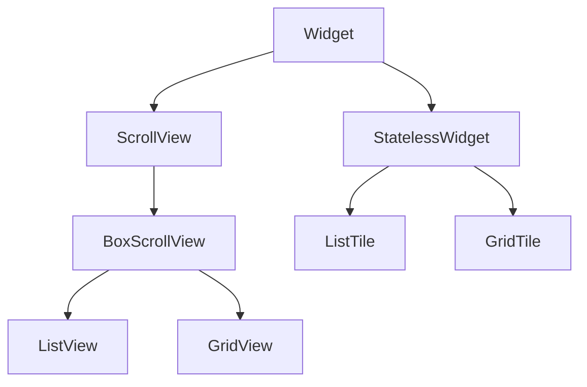

# Lists and Grids

Catalogs — tracks, albums, playlists — need **efficient scrolling collections**. Flutter's **`ListView`** and **`GridView`** extend **`ScrollView`** and support **lazy** builders that instantiate only visible children.

## Class hierarchy



| Widget | Layout |
|--------|--------|
| `ListView` | Single column (or row if horizontal) |
| `GridView` | 2D grid |
| `ListTile` | Standard row: leading, title, subtitle, trailing |
| `ReorderableListView` | Drag to reorder (playlists) |

## ListView constructors

| Constructor | When to use |
|-------------|-------------|
| `ListView(children: [...])` | Few fixed items |
| `ListView.builder` | Long or infinite lists |
| `ListView.separated` | Builder + dividers between items |
| `ListView.custom` | Custom `SliverChildDelegate` |

### builder — track list

```dart
ListView.builder(
  itemCount: tracks.length,
  itemBuilder: (context, index) {
    final track = tracks[index];
    return ListTile(
      leading: ClipRRect(
        borderRadius: BorderRadius.circular(4),
        child: Image.network(track.artUrl, width: 48, height: 48, fit: BoxFit.cover),
      ),
      title: Text(track.title, maxLines: 1, overflow: TextOverflow.ellipsis),
      subtitle: Text(track.artist),
      trailing: Text(track.durationLabel),
      onTap: () => play(track),
    );
  },
)
```

### separated

```dart
ListView.separated(
  itemCount: tracks.length,
  separatorBuilder: (context, index) => Divider(
    height: 1,
    indent: 72,
    color: Theme.of(context).dividerColor,
  ),
  itemBuilder: (context, index) => TrackTile(track: tracks[index]),
)
```

### horizontal album carousel

```dart
SizedBox(
  height: 180,
  child: ListView.separated(
    scrollDirection: Axis.horizontal,
    padding: const EdgeInsets.symmetric(horizontal: 16),
    itemCount: albums.length,
    separatorBuilder: (_, __) => const SizedBox(width: 12),
    itemBuilder: (context, index) => AlbumCard(album: albums[index]),
  ),
)
```

## ListTile API

```dart
ListTile(
  leading: const Icon(Icons.music_note),
  title: const Text('Liked Songs'),
  subtitle: const Text('482 tracks'),
  trailing: const Icon(Icons.chevron_right),
  dense: true,
  selected: isSelected,
  enabled: !isDisabled,
  onTap: openLikedSongs,
  onLongPress: showContextMenu,
  contentPadding: const EdgeInsets.symmetric(horizontal: 16),
)
```

| Variant | Use |
|---------|-----|
| `ListTile.controlAffinity` | Switch on left or right |
| `CheckboxListTile` | Toggle with checkbox |
| `SwitchListTile` | Settings toggles |
| `RadioListTile` | Single selection in group |

## GridView

| Constructor | Use |
|-------------|-----|
| `GridView.count` | Fixed cross-axis count |
| `GridView.extent` | Max cross-axis extent (responsive tile width) |
| `GridView.builder` | Lazy grid |

```dart
GridView.builder(
  padding: const EdgeInsets.all(16),
  gridDelegate: const SliverGridDelegateWithFixedCrossAxisCount(
    crossAxisCount: 2,
    mainAxisSpacing: 12,
    crossAxisSpacing: 12,
    childAspectRatio: 0.75,
  ),
  itemCount: playlists.length,
  itemBuilder: (context, index) => PlaylistGridTile(playlist: playlists[index]),
)
```

**`childAspectRatio`** = width / height of each cell. Tune for cover art + caption below.

### Responsive extent

```dart
gridDelegate: const SliverGridDelegateWithMaxCrossAxisExtent(
  maxCrossAxisExtent: 160,
  mainAxisSpacing: 8,
  crossAxisSpacing: 8,
  childAspectRatio: 0.8,
),
```

## ListView inside Column

Give bounded height:

```dart
Column(
  children: [
    const SectionHeader(title: 'Recently played'),
    Expanded(
      child: ListView.builder(
        itemCount: recent.length,
        itemBuilder: (context, i) => TrackTile(track: recent[i]),
      ),
    ),
  ],
)
```

Or `shrinkWrap: true` + `physics: NeverScrollableScrollPhysics()` for short lists inside outer scroll — **avoid** for long lists (builds all children).

## ReorderableListView

```dart
ReorderableListView.builder(
  itemCount: queue.length,
  onReorder: (oldIndex, newIndex) {
    setState(() {
      if (newIndex > oldIndex) newIndex -= 1;
      final item = queue.removeAt(oldIndex);
      queue.insert(newIndex, item);
    });
  },
  itemBuilder: (context, index) {
    final track = queue[index];
    return ListTile(
      key: ValueKey(track.id),
      title: Text(track.title),
      trailing: const Icon(Icons.drag_handle),
    );
  },
)
```

Each item needs a **unique `Key`**.

## Performance tips

- Use **`.builder`** for large data sets.
- Pass stable **`Key`s** (`ValueKey(id)`) for stateful tiles.
- Set **`cacheExtent`** to prebuild off-screen items if scrolling feels empty.
- Use **`itemExtent`** or **`prototypeItem`** when all rows have fixed height (faster layout).

## Summary

**`ListView.builder`** and **`GridView.builder`** are defaults for music catalogs. **`ListTile`** standardizes row layout. Bound height when nesting lists, use **keys** for reorder, and pick grid delegates (`count` vs `maxCrossAxisExtent`) for responsive album walls.
