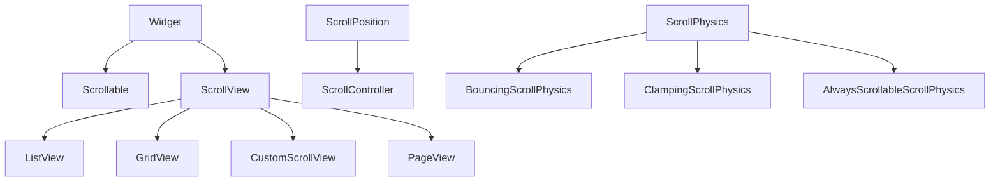

# Scrollables and Physics

Scrolling is how users explore long catalogs. Under the hood, **`Scrollable`** + **`Viewport`** + **`ScrollPosition`** coordinate drag, fling, and programmatic jumps. **`ScrollView`** widgets (`ListView`, `GridView`, `CustomScrollView`) are the main API surface.

## Class hierarchy



| Component | Role |
|-----------|------|
| `Scrollable` | Core scroll interaction |
| `Viewport` | Shows a slice of sliver/box content |
| `ScrollController` | Read `offset`, animate `animateTo`, `jumpTo` |
| `ScrollPhysics` | Overscroll, snapping, parent chaining |
| `PrimaryScrollController` | Inherited controller for `primary: true` scrollables |

## ScrollView shared parameters

```dart
ListView(
  controller: _scrollController,
  physics: const BouncingScrollPhysics(parent: AlwaysScrollableScrollPhysics()),
  padding: const EdgeInsets.only(bottom: 80), // space for mini player
  scrollDirection: Axis.vertical,
  reverse: false,
  primary: false,
  shrinkWrap: false,
  cacheExtent: 250,
  children: [...],
)
```

| Property | Notes |
|----------|-------|
| `controller` | Attach listeners; must `dispose` |
| `physics` | Platform feel and scrollability when content short |
| `primary` | If true, uses `PrimaryScrollController.of(context)` |
| `shrinkWrap` | Viewport sizes to children — expensive at scale |
| `cacheExtent` | Pixels to layout ahead of viewport |

## ScrollPhysics types

| Class | Behavior |
|-------|----------|
| `ClampingScrollPhysics` | Android-style edge glow, no bounce |
| `BouncingScrollPhysics` | iOS-style overscroll bounce |
| `NeverScrollableScrollPhysics` | Disable user scroll |
| `AlwaysScrollableScrollPhysics` | Scrollable even if content smaller than viewport |
| `FixedExtentScrollPhysics` | Page/snapping (used by `PageView`) |

Platform default:

```dart
physics: const AlwaysScrollableScrollPhysics(
  parent: BouncingScrollPhysics(),
),
```

Combine with **`parent:`** to layer behaviors.

### Disable scroll on nested list

```dart
ListView(
  physics: const NeverScrollableScrollPhysics(),
  shrinkWrap: true,
  children: items,
)
```

Used when an outer `CustomScrollView` should own scrolling.

## ScrollController

```dart
final _controller = ScrollController();

@override
void initState() {
  super.initState();
  _controller.addListener(_onScroll);
}

void _onScroll() {
  final showFab = _controller.offset > 200;
  if (showFab != _showFab) setState(() => _showFab = showFab);
}

@override
void dispose() {
  _controller.removeListener(_onScroll);
  _controller.dispose();
  super.dispose();
}

Future<void> scrollToTop() => _controller.animateTo(
  0,
  duration: const Duration(milliseconds: 400),
  curve: Curves.easeOutCubic,
);
```

| Property / method | Use |
|-------------------|-----|
| `offset` | Current scroll position |
| `position.maxScrollExtent` | Maximum scroll |
| `position.pixels` | Same as offset |
| `animateTo` / `jumpTo` | Programmatic scroll |

## PrimaryScrollController

`Scaffold` + `NestedScrollView` often coordinate with primary scroll:

```dart
PrimaryScrollController(
  controller: _controller,
  child: ListView.builder(...),
)
```

Only one primary scroll view per route is typical. Nested scrollables need explicit controllers or `primary: false`.

## PageView

Horizontal paging for onboarding or full-screen artwork:

```dart
PageController(pageController = PageController(viewportFraction: 0.9));

PageView.builder(
  controller: pageController,
  itemCount: albums.length,
  itemBuilder: (context, index) => AlbumHeroCard(album: albums[index]),
  onPageChanged: (index) => setState(() => currentIndex = index),
)
```

**`viewportFraction`** < 1 shows peek of adjacent pages (carousel).

### PageView vs TabBarView

| Widget | Swipe between | Tabs UI |
|--------|---------------|---------|
| `PageView` | Pages | Manual dots/indicators |
| `TabBarView` | Tabs | `TabBar` linked |

## Nested scrolling problem

**Symptom:** Inner list does not scroll, or outer scroll steals gestures.

**Fixes:**

1. One scrollable per axis branch — use slivers in one `CustomScrollView`.
2. `NestedScrollView` for header + tab body.
3. Set inner `primary: false` and distinct `ScrollController`.

```dart
CustomScrollView(
  slivers: [
    const SliverAppBar(title: Text('Browse')),
    SliverList.builder(
      itemCount: tracks.length,
      itemBuilder: (context, i) => TrackTile(track: tracks[i]),
    ),
  ],
)
```

## Scrollbar and ScrollConfiguration

```dart
Scrollbar(
  controller: _controller,
  thumbVisibility: true,
  child: ListView.builder(controller: _controller, ...),
)

ScrollConfiguration(
  behavior: ScrollConfiguration.of(context).copyWith(scrollbars: true),
  child: child,
)
```

Desktop apps should show scrollbars for discoverability.

## NotificationListener

React to scroll without owning controller:

```dart
NotificationListener<ScrollNotification>(
  onNotification: (notification) {
    if (notification is ScrollUpdateNotification) {
      parallaxOffset = notification.metrics.pixels;
    }
    return false;
  },
  child: ListView(...),
)
```

## Summary

**`ScrollController`** drives position; **`ScrollPhysics`** defines feel and chaining. Prefer a **single** `CustomScrollView` with slivers over fighting nested `ListView`s. Use **`PageView`** for carousels and **`Scrollbar`** on desktop. Dispose controllers and avoid `shrinkWrap` on large lists.
