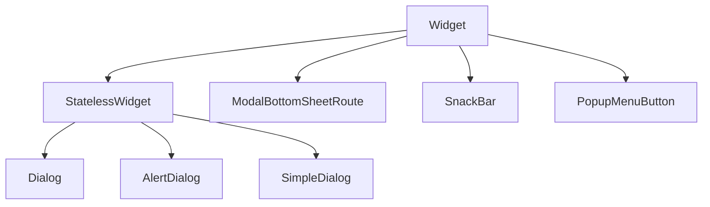

# Dialogs and Bottom Sheets

Transient UI — confirmations, menus, queues — sits above the route stack via **`showDialog`**, **`showModalBottomSheet`**, and **`ScaffoldMessenger`** for **`SnackBar`**. These use **`Navigator`** overlays, not new routes in the deep link sense.

## Class hierarchy



| API | Widget / route | Use |
|-----|----------------|-----|
| `showDialog` | `Dialog`, `AlertDialog` | Blocking decisions |
| `showModalBottomSheet` | Modal sheet | Actions, forms, queue |
| `showBottomSheet` | Persistent sheet | Rare; scaffold-attached |
| `ScaffoldMessenger.showSnackBar` | `SnackBar` | Brief feedback |
| `showMenu` / `PopupMenuButton` | Popup menu | Context actions |

## AlertDialog

```dart
Future<void> confirmDelete(BuildContext context) async {
  final ok = await showDialog<bool>(
    context: context,
    barrierDismissible: true,
    builder: (context) => AlertDialog(
      icon: const Icon(Icons.warning_amber_rounded),
      title: const Text('Remove download?'),
      content: const Text('You can download this album again later.'),
      actions: [
        TextButton(
          onPressed: () => Navigator.pop(context, false),
          child: const Text('Cancel'),
        ),
        FilledButton(
          onPressed: () => Navigator.pop(context, true),
          child: const Text('Remove'),
        ),
      ],
    ),
  );
  if (ok == true) await removeDownload();
}
```

| Parameter | Meaning |
|-----------|---------|
| `barrierDismissible` | Tap scrim to dismiss |
| `barrierColor` | Scrim color |
| `useRootNavigator` | Which navigator stack (default true) |

Return values via **`Navigator.pop(context, result)`** and `await showDialog<T>`.

## SimpleDialog — single-choice lists

```dart
showDialog<String>(
  context: context,
  builder: (context) => SimpleDialog(
    title: const Text('Audio quality'),
    children: [
      SimpleDialogOption(
        onPressed: () => Navigator.pop(context, 'high'),
        child: const Text('High (320 kbps)'),
      ),
      SimpleDialogOption(
        onPressed: () => Navigator.pop(context, 'normal'),
        child: const Text('Normal (160 kbps)'),
      ),
    ],
  ),
);
```

## Dialog (custom content)

```dart
showDialog(
  context: context,
  builder: (context) => Dialog(
    child: ConstrainedBox(
      constraints: const BoxConstraints(maxWidth: 400),
      child: Padding(
        padding: const EdgeInsets.all(24),
        child: Column(
          mainAxisSize: MainAxisSize.min,
          children: [
            Text('Share playlist', style: Theme.of(context).textTheme.titleLarge),
            const SizedBox(height: 16),
            TextField(decoration: const InputDecoration(labelText: 'Link')),
            const SizedBox(height: 24),
            FilledButton(onPressed: () => Navigator.pop(context), child: const Text('Copy')),
          ],
        ),
      ),
    ),
  ),
);
```

## showModalBottomSheet

```dart
Future<void> openTrackOptions(BuildContext context, Track track) {
  return showModalBottomSheet<void>(
    context: context,
    showDragHandle: true,
    isScrollControlled: true,
    useSafeArea: true,
    builder: (context) {
      return Padding(
        padding: EdgeInsets.only(
          bottom: MediaQuery.viewInsetsOf(context).bottom,
        ),
        child: Column(
          mainAxisSize: MainAxisSize.min,
          children: [
            ListTile(
              leading: const Icon(Icons.queue_music),
              title: const Text('Add to queue'),
              onTap: () {
                addToQueue(track);
                Navigator.pop(context);
              },
            ),
            ListTile(
              leading: const Icon(Icons.playlist_add),
              title: const Text('Add to playlist'),
              onTap: () { ... },
            ),
            ListTile(
              leading: Icon(Icons.delete_outline, color: Theme.of(context).colorScheme.error),
              title: Text('Remove', style: TextStyle(color: Theme.of(context).colorScheme.error)),
              onTap: () { ... },
            ),
          ],
        ),
      );
    },
  );
}
```

| Flag | Purpose |
|------|---------|
| `isScrollControlled` | Sheet can use full height / keyboard inset |
| `showDragHandle` | M3 drag affordance |
| `backgroundColor` / `shape` | Rounded top corners |
| `enableDrag` | Swipe down to dismiss |

### Full-height queue sheet

```dart
showModalBottomSheet(
  context: context,
  isScrollControlled: true,
  builder: (context) => DraggableScrollableSheet(
    expand: false,
    initialChildSize: 0.6,
    minChildSize: 0.3,
    maxChildSize: 0.95,
    builder: (context, scrollController) => QueueList(controller: scrollController),
  ),
);
```

**`DraggableScrollableSheet`** links drag resize with list scroll.

## SnackBar

```dart
ScaffoldMessenger.of(context).showSnackBar(
  SnackBar(
    content: const Text('Added to Liked Songs'),
    action: SnackBarAction(
      label: 'Undo',
      onPressed: undoLike,
    ),
    behavior: SnackBarBehavior.floating,
    duration: const Duration(seconds: 4),
  ),
);
```

Show from root scaffold context — if inside nested scaffold, use `rootScaffoldMessengerKey` or correct messenger.

## PopupMenuButton

```dart
PopupMenuButton<PlaylistAction>(
  onSelected: (action) => handleAction(action),
  itemBuilder: (context) => [
    const PopupMenuItem(value: PlaylistAction.rename, child: Text('Rename')),
    const PopupMenuItem(value: PlaylistAction.share, child: Text('Share')),
    const PopupMenuDivider(),
    PopupMenuItem(
      value: PlaylistAction.delete,
      child: Text('Delete', style: TextStyle(color: Theme.of(context).colorScheme.error)),
    ),
  ],
)
```

## showAdaptiveDialog / bottom sheet

For platform-native chrome:

```dart
showAdaptiveDialog(
  context: context,
  builder: (context) => AlertDialog.adaptive(
    title: const Text('Sign out?'),
    actions: [
      TextButton(onPressed: () => Navigator.pop(context), child: const Text('Cancel')),
      TextButton(onPressed: signOut, child: const Text('Sign out')),
    ],
  ),
);
```


<!-- enriched:v3 -->

## Scenario

HarborCart destructive clears used full-screen routes accidentally.

## Deep dive

Dialogs for short decisions; modal sheets for contextual actions; SnackBar for undo.

## Extended example

```dart
final ok = await showDialog<bool>(
  context: context,
  builder: (c) => AlertDialog(
    title: const Text('Clear cart?'),
    actions: [
      TextButton(onPressed: () => Navigator.pop(c, false), child: const Text('Cancel')),
      FilledButton(onPressed: () => Navigator.pop(c, true), child: const Text('Clear')),
    ],
  ),
);
```

## Refined UI note

Sheets with drag handles feel native on mobile; keep dialog width ≤ 400dp on desktop.

## Try it

- Build queue bottom sheet.
- Show SnackBar undo.

## Summary

**`AlertDialog`** for short confirmations; **`showModalBottomSheet`** for track options and queues; **`SnackBar`** for undo feedback. Use **`isScrollControlled`** and **`DraggableScrollableSheet`** for tall content. Always **`Navigator.pop`** with results when awaiting user choice.
