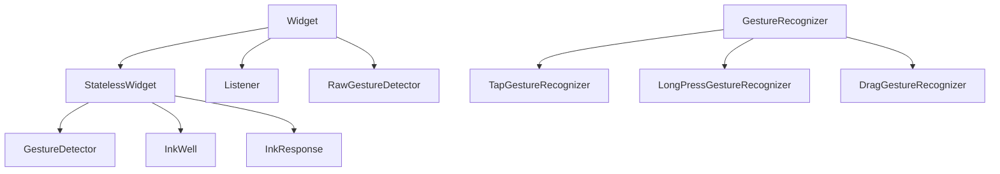

# Gestures

Touch, mouse, and stylus input flow through a **gesture arena** where competing recognizers disambiguate taps vs drags. Flutter exposes high-level widgets (**`GestureDetector`**, **`InkWell`**) and low-level **`Listener`** / **`RawGestureDetector`**.

## Class hierarchy



| Widget | Material splash | Gestures | Hit test |
|--------|-----------------|----------|----------|
| `GestureDetector` | No | Broad set | Opaque to configured gestures |
| `InkWell` / `InkResponse` | Yes (needs `Material` ancestor) | Tap, long press, highlight | Yes |
| `Listener` | No | Raw pointers (down/move/up) | Configurable `behavior` |
| `IconButton` | Built-in | Tap | Minimum 48×48 target |

## GestureDetector

```dart
GestureDetector(
  behavior: HitTestBehavior.opaque,
  onTap: () => play(track),
  onDoubleTap: () => like(track),
  onLongPress: () => showTrackMenu(context),
  onHorizontalDragUpdate: (details) {
    dragOffset += details.delta.dx;
  },
  onHorizontalDragEnd: (details) {
    if (details.primaryVelocity != null && details.primaryVelocity! > 300) {
      skipPrevious();
    } else if (details.primaryVelocity != null && details.primaryVelocity! < -300) {
      skipNext();
    }
  },
  child: AlbumArtwork(url: track.artUrl),
)
```

### Common callbacks

| Callback | Trigger |
|----------|---------|
| `onTapDown` / `onTapUp` / `onTapCancel` | Full tap lifecycle |
| `onPanUpdate` | Any direction drag |
| `onVerticalDrag*` / `onHorizontalDrag*` | Axis-locked drag |
| `onScaleUpdate` | Pinch (needs `ScaleGestureRecognizer` via scale callbacks on newer APIs) |

Use **`behavior: HitTestBehavior.opaque`** when the child is transparent but should receive taps.

## InkWell and Material ripples

```dart
Material(
  color: Colors.transparent,
  child: InkWell(
    borderRadius: BorderRadius.circular(8),
    onTap: onTap,
    child: Padding(
      padding: const EdgeInsets.all(12),
      child: Row(
        children: [
          const Icon(Icons.playlist_play),
          const SizedBox(width: 12),
          Text(playlist.name),
        ],
      ),
    ),
  ),
)
```

**`InkWell`** must be under **`Material`** (or `Card`, `Scaffold` body with material). Use **`Ink`** decoration for custom splash clipping.

### InkResponse

Lower-level than `InkWell` — control highlight/splash colors:

```dart
InkResponse(
  onTap: onTap,
  splashColor: Colors.white24,
  highlightColor: Colors.white10,
  child: const SizedBox(width: 48, height: 48, child: Icon(Icons.more_vert)),
)
```

## Listener — pointer-level

```dart
Listener(
  onPointerDown: (e) => print('down at ${e.position}'),
  onPointerMove: (e) => updateScrub(e.localPosition),
  onPointerUp: (e) => commitScrub(),
  child: CustomPaint(painter: WaveformPainter(...), size: Size.infinite),
)
```

Use for custom painters, waveform scrubbing, or when gesture arena interferes.

## Gesture arena (concept)

Multiple recognizers (scroll vs tap) compete. Horizontal drag on a `ListView` usually wins over parent `onHorizontalDrag`. Fixes:

- Use **`ScrollConfiguration`** or separate gesture direction.
- Wrap draggable area in widget that does not scroll.
- **`RawGestureDetector`** with custom recognizer factory.

## Dismissible — swipe to delete

```dart
Dismissible(
  key: ValueKey(track.id),
  direction: DismissDirection.endToStart,
  background: Container(
    color: Theme.of(context).colorScheme.error,
    alignment: Alignment.centerRight,
    padding: const EdgeInsets.only(right: 16),
    child: const Icon(Icons.delete, color: Colors.white),
  ),
  confirmDismiss: (direction) async {
    return await showDialog<bool>(...) ?? false;
  },
  onDismissed: (_) => removeFromQueue(track),
  child: QueueTile(track: track),
)
```

## InteractiveViewer — pinch/pan zoom

```dart
InteractiveViewer(
  minScale: 1,
  maxScale: 4,
  child: Image.network(largeArtUrl),
)
```

## AbsorbPointer and IgnorePointer

```dart
AbsorbPointer(
  absorbing: isLoading,
  child: PlayerControls(),
)
```

Block hit testing during buffering without changing opacity.

## Semantics and gestures

Pair gestures with semantics for screen readers:

```dart
Semantics(
  button: true,
  label: 'Play ${track.title}',
  child: GestureDetector(onTap: play, child: ...),
)
```


<!-- enriched:v3 -->

## Scenario

PulseRoutine swipe-to-skip clashed with horizontal page navigation.

## Deep dive

Gesture arena picks winners; use Listener for raw pointers on custom painters.

## Extended example

```dart
GestureDetector(
  behavior: HitTestBehavior.opaque,
  onHorizontalDragEnd: (d) {
    if ((d.primaryVelocity ?? 0) > 300) skip();
  },
  child: sessionCard,
);
```

## Refined UI note

InkWell for Material splash; GestureDetector for custom drag on artwork.

## Try it

- Add Dismissible removal.
- Compare InkWell vs GestureDetector.

## Summary

Use **`InkWell`** for Material list rows with splash; **`GestureDetector`** for custom drags on artwork. **`Listener`** handles raw pointers on custom paint. Respect the gesture arena when combining scroll with horizontal swipes. **`Dismissible`** implements swipe-to-remove in queues.
