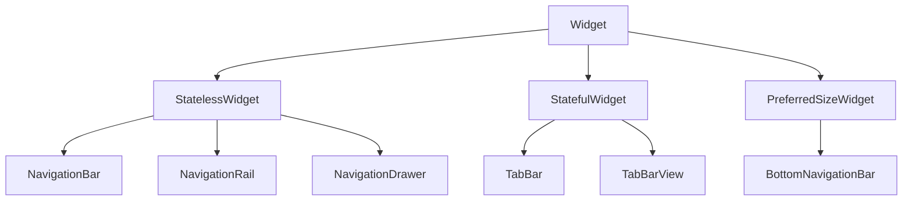

# Tabs and NavigationRail

Multi-section apps need **primary navigation** — bottom bars on phones, side rails on desktop, and **tabs** for sibling views within a section. Material 3 unifies patterns with **`NavigationBar`**, **`NavigationRail`**, **`NavigationDrawer`**, and **`TabBar`**.

## Class hierarchy



| Widget | Typical platform | Placement |
|--------|------------------|-----------|
| `NavigationBar` | Mobile (M3) | Bottom |
| `BottomNavigationBar` | Mobile (M2 legacy) | Bottom |
| `NavigationRail` | Desktop / tablet | Start side |
| `NavigationDrawer` | Wider layouts | Modal or permanent drawer |
| `TabBar` | In-screen sections | Below app bar |
| `TabBarView` | Tab content | Swipeable pages |

## NavigationBar (Material 3)

```dart
int _index = 0;

Scaffold(
  body: _pages[_index],
  bottomNavigationBar: NavigationBar(
    selectedIndex: _index,
    onDestinationSelected: (i) => setState(() => _index = i),
    destinations: const [
      NavigationDestination(icon: Icon(Icons.home_outlined), selectedIcon: Icon(Icons.home), label: 'Home'),
      NavigationDestination(icon: Icon(Icons.search_outlined), selectedIcon: Icon(Icons.search), label: 'Search'),
      NavigationDestination(icon: Icon(Icons.library_music_outlined), selectedIcon: Icon(Icons.library_music), label: 'Library'),
    ],
  ),
)
```

| Property | Notes |
|----------|-------|
| `selectedIndex` | Current tab |
| `destinations` | 3–5 items recommended |
| `labelBehavior` | `alwaysShow`, `onlyShowSelected`, etc. |
| `height` | Default tuned for touch |

Use distinct **outlined vs filled** icons for selected state.

## NavigationRail

```dart
Scaffold(
  body: Row(
    children: [
      NavigationRail(
        selectedIndex: _index,
        onDestinationSelected: (i) => setState(() => _index = i),
        labelType: NavigationRailLabelType.all,
        extended: isExtended,
        leading: const SizedBox(height: 8),
        trailing: Expanded(
          child: Align(
            alignment: Alignment.bottomCenter,
            child: IconButton(
              icon: const Icon(Icons.settings_outlined),
              onPressed: openSettings,
            ),
          ),
        ),
        destinations: const [
          NavigationRailDestination(icon: Icon(Icons.home_outlined), selectedIcon: Icon(Icons.home), label: Text('Home')),
          NavigationRailDestination(icon: Icon(Icons.search_outlined), selectedIcon: Icon(Icons.search), label: Text('Search')),
          NavigationRailDestination(icon: Icon(Icons.library_music_outlined), selectedIcon: Icon(Icons.library_music), label: Text('Library')),
        ],
      ),
      const VerticalDivider(thickness: 1, width: 1),
      Expanded(child: _pages[_index]),
    ],
  ),
)
```

| Property | Purpose |
|----------|---------|
| `extended` | Wider rail with labels always visible |
| `minExtendedWidth` | Threshold when `extended` is true |
| `labelType` | Show labels on all or selected only |
| `groupAlignment` | Vertical alignment of destinations |

Toggle **`extended`** when window width exceeds a breakpoint (`LayoutBuilder`).

## Adaptive shell pattern

```dart
Widget build(BuildContext context) {
  final width = MediaQuery.sizeOf(context).width;
  if (width >= 800) {
    return _DesktopShell(index: index, onIndexChanged: setIndex, child: _pages[index]);
  }
  return _MobileShell(index: index, onIndexChanged: setIndex, child: _pages[index]);
}
```

Same `_pages` list; only chrome changes — state preserved if shell is above `IndexedStack` or state holder.

## TabBar + TabBarView

Requires **`DefaultTabController`** or explicit **`TabController`** with `TickerProviderStateMixin`:

```dart
class ArtistScreen extends StatefulWidget {
  const ArtistScreen({super.key});
  @override
  State<ArtistScreen> createState() => _ArtistScreenState();
}

class _ArtistScreenState extends State<ArtistScreen> with SingleTickerProviderStateMixin {
  late final TabController _tabController;

  @override
  void initState() {
    super.initState();
    _tabController = TabController(length: 3, vsync: this);
  }

  @override
  void dispose() {
    _tabController.dispose();
    super.dispose();
  }

  @override
  Widget build(BuildContext context) {
    return Scaffold(
      appBar: AppBar(
        title: const Text('Artist'),
        bottom: TabBar(
          controller: _tabController,
          tabs: const [
            Tab(text: 'Music'),
            Tab(text: 'Albums'),
            Tab(text: 'About'),
          ],
        ),
      ),
      body: TabBarView(
        controller: _tabController,
        children: const [
          ArtistTracksTab(),
          ArtistAlbumsTab(),
          ArtistAboutTab(),
        ],
      ),
    );
  }
}
```

| Widget | Role |
|--------|------|
| `Tab` | Label/icon in bar |
| `TabBarView` | Swipe between tab bodies |
| `TabController` | Sync index; listen for changes |

### Scrollable TabBar

Many tabs:

```dart
TabBar(
  isScrollable: true,
  tabAlignment: TabAlignment.start,
  tabs: genres.map((g) => Tab(text: g)).toList(),
)
```

## NavigationDrawer

```dart
Drawer(
  child: ListView(
    children: [
      const DrawerHeader(child: Text('Melody Hub')),
      ListTile(leading: const Icon(Icons.home), title: const Text('Home'), onTap: ...),
      ListTile(leading: const Icon(Icons.settings), title: const Text('Settings'), onTap: ...),
    ],
  ),
)
```

**`NavigationDrawer`** (M3) provides styled destinations similar to rail.

## BottomNavigationBar (legacy)

Still common in older codebases:

```dart
BottomNavigationBar(
  currentIndex: _index,
  onTap: (i) => setState(() => _index = i),
  type: BottomNavigationBarType.fixed,
  items: const [
    BottomNavigationBarItem(icon: Icon(Icons.home), label: 'Home'),
    BottomNavigationBarItem(icon: Icon(Icons.search), label: 'Search'),
  ],
)
```

Prefer **`NavigationBar`** for new M3 apps.

## Stateful navigation with go_router

For deep links, define branches:

```dart
StatefulShellRoute.indexedStack(
  builder: (context, state, navigationShell) => AdaptiveScaffold(shell: navigationShell),
  branches: [
    StatefulShellBranch(routes: [GoRoute(path: '/home', builder: ...)]),
    StatefulShellBranch(routes: [GoRoute(path: '/search', builder: ...)]),
  ],
)
```

Shell keeps each branch's stack alive — analogous to `IndexedStack` for nav tabs.

## Summary

**`NavigationBar`** for mobile primary nav; **`NavigationRail`** for desktop width; **`TabBar`/`TabBarView`** for in-screen sections like artist catalogs. Use **`LayoutBuilder`** or width breakpoints for adaptive shells. Dispose **`TabController`** and keep page lists shared so switching destinations does not reset player state unintentionally.
