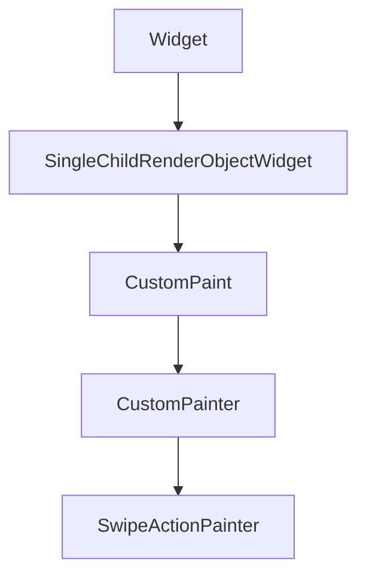

# CustomPaint and Canvas

**`CustomPaint`** is optional for the email inbox — but it is the right tool when you want **drawn** swipe backgrounds (icons + labels) instead of plain `ColoredBox` widgets. This chapter shows both approaches; Chapter 4 uses widget-based backgrounds for clarity, and this chapter shows how to paint them.

## Class hierarchy



| Class | Role |
|-------|------|
| `CustomPaint` | Sizes child + painter layer |
| `CustomPainter` | `paint(Canvas, Size)` + `shouldRepaint` |
| `Canvas` | `drawRect`, `drawPath`, `drawText` via `TextPainter` |

## Basic CustomPaint

```dart
class DiagonalStripePainter extends CustomPainter {
  DiagonalStripePainter({required this.color});
  final Color color;

  @override
  void paint(Canvas canvas, Size size) {
    final paint = Paint()..color = color..strokeWidth = 2;
    const step = 12.0;
    for (var x = -size.height; x < size.width; x += step) {
      canvas.drawLine(Offset(x, size.height), Offset(x + size.height, 0), paint);
    }
  }

  @override
  bool shouldRepaint(DiagonalStripePainter old) => old.color != color;
}

// Usage behind a row:
Stack(
  children: [
    Positioned.fill(
      child: CustomPaint(painter: DiagonalStripePainter(color: Colors.red.shade700)),
    ),
    foregroundChild,
  ],
)
```

## Swipe action background painter

When the user drags a row, reveal a painted layer with icon and label:

```dart
class SwipeActionBackgroundPainter extends CustomPainter {
  SwipeActionBackgroundPainter({
    required this.color,
    required this.icon,
    required this.label,
    required this.alignment,
  });

  final Color color;
  final IconData icon;
  final String label;
  final Alignment alignment;

  @override
  void paint(Canvas canvas, Size size) {
    canvas.drawRect(Offset.zero & size, Paint()..color = color);

    final textPainter = TextPainter(
      text: TextSpan(
        text: label,
        style: const TextStyle(color: Colors.white, fontWeight: FontWeight.w600),
      ),
      textDirection: TextDirection.ltr,
    )..layout();

    const iconSize = 28.0;
    final isLeft = alignment == Alignment.centerLeft;
    final dx = isLeft ? 24.0 : size.width - 24.0 - iconSize;
    const dy = 20.0;

    final iconPainter = TextPainter(
      text: TextSpan(
        text: String.fromCharCode(icon.codePoint),
        style: TextStyle(
          fontFamily: icon.fontFamily,
          package: icon.fontPackage,
          fontSize: iconSize,
          color: Colors.white,
        ),
      ),
      textDirection: TextDirection.ltr,
    )..layout();
    iconPainter.paint(canvas, Offset(dx, dy));

    textPainter.paint(
      canvas,
      Offset(isLeft ? dx : dx - textPainter.width + iconSize, dy + iconSize + 4),
    );
  }

  @override
  bool shouldRepaint(SwipeActionBackgroundPainter old) =>
      old.color != color || old.label != label || old.alignment != alignment;
}
```

In practice, placing **`Icon`** + **`Text`** in a `Row` under a `Stack` is easier to maintain; use `CustomPainter` when you need shapes, stripes, or progress arcs on the row.

## CustomPaint with foreground painter

```dart
CustomPaint(
  foregroundPainter: BorderPainter(radius: 12),
  child: ListTile(title: Text('Inbox')),
)
```

`foregroundPainter` draws **on top** of the child — useful for selection outlines without wrapping in `DecoratedBox`.

## Performance

- Implement **`shouldRepaint`** to return `false` when nothing changed.
- Avoid `CustomPaint` on every row if hundreds are visible — use simple `Container` colors (Chapter 4 default).
- Repaint boundaries: `RepaintBoundary` around animated swipe tiles isolates layer invalidation.


<!-- enriched:v3 -->

## Scenario

PulseRoutine waveform scrubber needed custom stroke not available in stock widgets.

## Deep dive

CustomPainter draws paths; implement shouldRepaint precisely.

## Extended example

```dart
class SparklinePainter extends CustomPainter {
  SparklinePainter(this.points);
  final List<double> points;
  @override
  void paint(Canvas canvas, Size size) {
    final paint = Paint()..strokeWidth = 2..color = const Color(0xFF14B8A6);
    final path = Path();
    for (var i = 0; i < points.length; i++) {
      final x = size.width * i / (points.length - 1);
      final y = size.height * (1 - points[i]);
      if (i == 0) path.moveTo(x, y); else path.lineTo(x, y);
    }
    canvas.drawPath(path, paint);
  }
  @override
  bool shouldRepaint(SparklinePainter old) => old.points != points;
}
```

## Refined UI note

RepaintBoundary around animated painters prevents full-screen repaints.

## Try it

- Draw rounded rect badge.
- Toggle shouldRepaint demo.

## Summary

**`CustomPaint`** draws swipe backgrounds, stripes, and borders. The email list capstone can use **`Stack` + `ColoredBox` + `Icon`** or this painter for richer action lanes. Keep painters stateless; drive colors from **`InboxThemeExtension`**.
