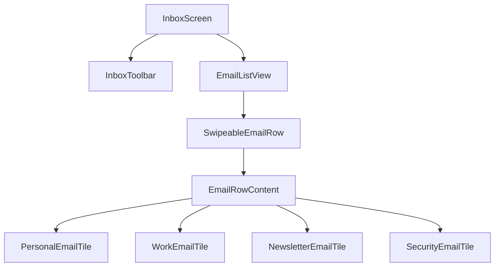

# Composing Custom Widgets

A feature-rich inbox is not one giant `build` method. Split by **responsibility**: data model, sort/filter state, row **content** by email type, swipe chrome, and the **list host** that wires `ReorderableListView`.

## Composition map



| Widget | Responsibility |
|--------|----------------|
| `InboxScreen` | Theme menu, filter chips, sort menu, owns `List<EmailMessage>` |
| `EmailListView` | `ReorderableListView`, applies filtered sorted list |
| `SwipeableEmailRow` | Horizontal drag, exposes left/right actions |
| `EmailRowContent` | Factory → correct tile for `EmailKind` |
| `*EmailTile` | Custom layout per content type |

## Email model and kinds

```dart
enum EmailKind { personal, work, newsletter, security }

enum EmailSort { newest, oldest, subject, sender }

class EmailMessage {
  const EmailMessage({
    required this.id,
    required this.kind,
    required this.from,
    required this.subject,
    required this.preview,
    required this.received,
    this.unread = true,
    this.starred = false,
  });

  final String id;
  final EmailKind kind;
  final String from;
  final String subject;
  final String preview;
  final DateTime received;
  final bool unread;
  final bool starred;

  EmailMessage copyWith({bool? unread, bool? starred}) => EmailMessage(
        id: id,
        kind: kind,
        from: from,
        subject: subject,
        preview: preview,
        received: received,
        unread: unread ?? this.unread,
        starred: starred ?? this.starred,
      );
}
```

## Factory: content by email type

```dart
class EmailRowContent extends StatelessWidget {
  const EmailRowContent({super.key, required this.email});

  final EmailMessage email;

  @override
  Widget build(BuildContext context) {
    final inbox = inboxTheme(context);
    return switch (email.kind) {
      EmailKind.personal => _PersonalTile(email: email, accent: inbox.personalAccent),
      EmailKind.work => _WorkTile(email: email, accent: inbox.workAccent),
      EmailKind.newsletter => _NewsletterTile(email: email, accent: inbox.newsletterAccent),
      EmailKind.security => _SecurityTile(email: email, accent: inbox.securityAccent),
    };
  }
}
```

### Personal — avatar circle + casual preview

```dart
class _PersonalTile extends StatelessWidget {
  const _PersonalTile({required this.email, required this.accent});
  final EmailMessage email;
  final Color accent;

  @override
  Widget build(BuildContext context) {
    return Row(
      crossAxisAlignment: CrossAxisAlignment.start,
      children: [
        CircleAvatar(backgroundColor: accent, child: Text(email.from[0].toUpperCase())),
        const SizedBox(width: 12),
        Expanded(
          child: Column(
            crossAxisAlignment: CrossAxisAlignment.start,
            children: [
              Text(email.from, style: const TextStyle(fontWeight: FontWeight.w600)),
              Text(email.subject, maxLines: 1, overflow: TextOverflow.ellipsis),
              Text(email.preview, maxLines: 2, overflow: TextOverflow.ellipsis,
                  style: Theme.of(context).textTheme.bodySmall),
            ],
          ),
        ),
        if (email.starred) Icon(Icons.star, size: 18, color: accent),
      ],
    );
  }
}
```

### Work — label chip + subject emphasis

```dart
class _WorkTile extends StatelessWidget {
  const _WorkTile({required this.email, required this.accent});
  final EmailMessage email;
  final Color accent;

  @override
  Widget build(BuildContext context) {
    return Column(
      crossAxisAlignment: CrossAxisAlignment.start,
      children: [
        Row(
          children: [
            Container(
              padding: const EdgeInsets.symmetric(horizontal: 8, vertical: 2),
              decoration: BoxDecoration(
                color: accent.withValues(alpha: 0.2),
                borderRadius: BorderRadius.circular(4),
              ),
              child: Text('WORK', style: TextStyle(fontSize: 10, color: accent, fontWeight: FontWeight.bold)),
            ),
            const Spacer(),
            Text(_formatTime(email.received), style: Theme.of(context).textTheme.labelSmall),
          ],
        ),
        const SizedBox(height: 4),
        Text(email.subject, style: Theme.of(context).textTheme.titleSmall),
        Text('${email.from} — ${email.preview}', maxLines: 1, overflow: TextOverflow.ellipsis),
      ],
    );
  }
}
```

### Newsletter — wide banner strip

```dart
class _NewsletterTile extends StatelessWidget {
  const _NewsletterTile({required this.email, required this.accent});
  final EmailMessage email;
  final Color accent;

  @override
  Widget build(BuildContext context) {
    return Row(
      children: [
        Container(
          width: 4,
          height: 56,
          decoration: BoxDecoration(color: accent, borderRadius: BorderRadius.circular(2)),
        ),
        const SizedBox(width: 12),
        Expanded(
          child: Column(
            crossAxisAlignment: CrossAxisAlignment.start,
            children: [
              Text(email.subject, fontWeight: FontWeight.w600),
              Text(email.preview, maxLines: 2, overflow: TextOverflow.ellipsis),
            ],
          ),
        ),
        Icon(Icons.campaign_outlined, color: accent),
      ],
    );
  }
}
```

### Security — alert icon + high contrast border

```dart
class _SecurityTile extends StatelessWidget {
  const _SecurityTile({required this.email, required this.accent});
  final EmailMessage email;
  final Color accent;

  @override
  Widget build(BuildContext context) {
    return Row(
      children: [
        Icon(Icons.shield_outlined, color: accent, size: 32),
        const SizedBox(width: 12),
        Expanded(
          child: Column(
            crossAxisAlignment: CrossAxisAlignment.start,
            children: [
              Text('Security alert', style: TextStyle(color: accent, fontWeight: FontWeight.bold)),
              Text(email.subject),
              Text(email.preview, maxLines: 1, overflow: TextOverflow.ellipsis),
            ],
          ),
        ),
      ],
    );
  }
}

String _formatTime(DateTime dt) {
  final h = dt.hour.toString().padLeft(2, '0');
  final m = dt.minute.toString().padLeft(2, '0');
  return '$h:$m';
}
```

## Sorting and filtering (pure Dart)

Keep logic in the screen state — no packages:

```dart
List<EmailMessage> applyInboxQuery(
  List<EmailMessage> source, {
  required String query,
  required Set<EmailKind>? kindsFilter,
  required bool? unreadOnly,
  required EmailSort sort,
}) {
  var list = List<EmailMessage>.from(source);

  if (query.trim().isNotEmpty) {
    final q = query.toLowerCase();
    list = list.where((e) {
      return e.subject.toLowerCase().contains(q) ||
          e.from.toLowerCase().contains(q) ||
          e.preview.toLowerCase().contains(q);
    }).toList();
  }

  if (kindsFilter != null && kindsFilter.isNotEmpty) {
    list = list.where((e) => kindsFilter.contains(e.kind)).toList();
  }

  if (unreadOnly == true) {
    list = list.where((e) => e.unread).toList();
  }

  list.sort((a, b) => switch (sort) {
        EmailSort.newest => b.received.compareTo(a.received),
        EmailSort.oldest => a.received.compareTo(b.received),
        EmailSort.subject => a.subject.compareTo(b.subject),
        EmailSort.sender => a.from.compareTo(b.from),
      });

  return list;
}
```

UI: **`TextField`** for query, **`FilterChip`** per `EmailKind`, **`PopupMenuButton<EmailSort>`** for sort.


<!-- enriched:v3 -->

## Scenario

Melody Hub duplicated queue row UI in three screens until extracted.

## Deep dive

Small focused widgets with explicit parameters beat copy-paste build methods.

## Extended example

```dart
class QueueRow extends StatelessWidget {
  const QueueRow({super.key, required this.title, required this.subtitle, this.onTap});
  final String title; final String subtitle; final VoidCallback? onTap;
  @override
  Widget build(BuildContext context) {
    return ListTile(title: Text(title), subtitle: Text(subtitle), onTap: onTap);
  }
}
```

## Refined UI note

Name widgets after intent (`QueueRow`), not layout (`Row2`).

## Try it

- Extract third tile variant.
- Document public API in doc comment.

## Summary

Compose the inbox from a **factory** (`EmailRowContent`), **kind-specific tiles**, and **pure functions** for sort/filter. Chapter 4 adds **swipe**, **reorder**, and **theme** wiring in one screen.
