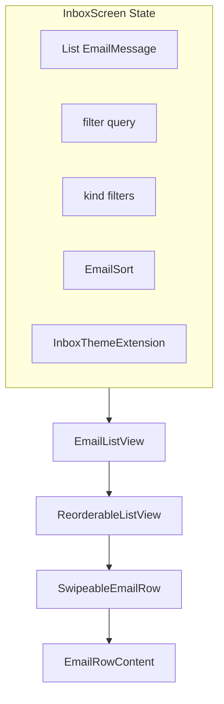

# Custom Email Inbox List

This chapter builds a **complete inbox list** using only the Flutter SDK:

| Feature | Flutter widgets / APIs |
|---------|-------------------------|
| Custom row by email type | `switch` + composed tiles (Chapter 3) |
| Swipe left / right actions | `Stack` + `GestureDetector` + `AnimatedContainer` |
| Sort & filter | `TextField`, `FilterChip`, `PopupMenuButton` + pure Dart |
| Drag reorder | `ReorderableListView` + `ReorderableDragStartListener` |
| Color themes | `ThemeExtension<InboxThemeExtension>` (Chapter 1) |

No `flutter_slidable`, `provider`, or other pub packages — only `material.dart` and `dart:` libraries.

## Architecture



## SwipeableEmailRow — both directions without packages

`Dismissible` only handles one dismiss direction per axis reliably. For **archive on swipe right** and **delete on swipe left**, track horizontal drag offset manually:

```dart
import 'package:flutter/material.dart';

typedef SwipeActionCallback = void Function();

class SwipeableEmailRow extends StatefulWidget {
  const SwipeableEmailRow({
    super.key,
    required this.inboxTheme,
    required this.child,
    required this.onArchive,
    required this.onDelete,
    required this.onStar,
  });

  final InboxThemeExtension inboxTheme;
  final Widget child;
  final SwipeActionCallback onArchive;
  final SwipeActionCallback onDelete;
  final SwipeActionCallback onStar;

  static const _actionWidth = 88.0;
  static const _trigger = 72.0;

  @override
  State<SwipeableEmailRow> createState() => _SwipeableEmailRowState();
}

class _SwipeableEmailRowState extends State<SwipeableEmailRow> {
  double _offset = 0;

  void _onDragUpdate(DragUpdateDetails details) {
    setState(() {
      _offset = (_offset + details.delta.dx).clamp(-SwipeableEmailRow._actionWidth * 2, SwipeableEmailRow._actionWidth * 2);
    });
  }

  void _onDragEnd(DragEndDetails details) {
    final vx = details.primaryVelocity ?? 0;
    if (_offset > SwipeableEmailRow._trigger || vx > 500) {
      widget.onArchive();
      _snap(0);
    } else if (_offset < -SwipeableEmailRow._trigger || vx < -500) {
      widget.onDelete();
      _snap(0);
    } else if (_offset < -40 && _offset > -SwipeableEmailRow._trigger) {
      widget.onStar();
      _snap(0);
    } else {
      _snap(0);
    }
  }

  void _snap(double target) {
    setState(() => _offset = target);
  }

  @override
  Widget build(BuildContext context) {
  final t = widget.inboxTheme;
    return ClipRRect(
      borderRadius: BorderRadius.circular(12),
      child: Stack(
        children: [
          // Right swipe reveals left-aligned actions (archive)
          Positioned.fill(
            child: Row(
              children: [
                _ActionLane(color: t.swipeArchive, icon: Icons.archive_outlined, label: 'Archive'),
                if (_offset < 0) _ActionLane(color: t.swipeStar, icon: Icons.star_outline, label: 'Star'),
                const Spacer(),
                if (_offset < -SwipeableEmailRow._trigger)
                  _ActionLane(color: t.swipeDelete, icon: Icons.delete_outline, label: 'Delete'),
              ],
            ),
          ),
          GestureDetector(
            onHorizontalDragUpdate: _onDragUpdate,
            onHorizontalDragEnd: _onDragEnd,
            child: Transform.translate(
              offset: Offset(_offset, 0),
              child: Material(
                elevation: _offset != 0 ? 2 : 0,
                color: Colors.transparent,
                child: widget.child,
              ),
            ),
          ),
        ],
      ),
    );
  }
}

class _ActionLane extends StatelessWidget {
  const _ActionLane({required this.color, required this.icon, required this.label});
  final Color color;
  final IconData icon;
  final String label;

  @override
  Widget build(BuildContext context) {
    return Container(
      width: SwipeableEmailRow._actionWidth,
      color: color,
      child: Column(
        mainAxisAlignment: MainAxisAlignment.center,
        children: [
          Icon(icon, color: Colors.white),
          const SizedBox(height: 4),
          Text(label, style: const TextStyle(color: Colors.white, fontSize: 11)),
        ],
      ),
    );
  }
}
```

| Gesture | Threshold | Action |
|---------|-----------|--------|
| Drag right | `offset > 72` or velocity | `onArchive` |
| Drag left far | `offset < -72` | `onDelete` |
| Drag left slightly | `-72 < offset < -40` | `onStar` |
| Release otherwise | snap `offset` → 0 | visual reset |

Swipe detection runs on the **center** of the row; the **drag handle** for reorder is separate (below) so gestures do not conflict.

## Row chrome — unread + theme colors

```dart
class EmailListTileShell extends StatelessWidget {
  const EmailListTileShell({
    super.key,
    required this.email,
    required this.inboxTheme,
    required this.content,
    required this.dragHandle,
  });

  final EmailMessage email;
  final InboxThemeExtension inboxTheme;
  final Widget content;
  final Widget dragHandle;

  @override
  Widget build(BuildContext context) {
    final bg = email.unread ? inboxTheme.unreadRowColor : inboxTheme.readRowColor;
    return Container(
      padding: const EdgeInsets.fromLTRB(8, 10, 8, 10),
      decoration: BoxDecoration(
        color: bg,
        borderRadius: BorderRadius.circular(12),
        border: email.unread ? Border.all(color: inboxTheme.unreadBorder, width: 2) : null,
      ),
      child: Row(
        crossAxisAlignment: CrossAxisAlignment.start,
        children: [
          dragHandle,
          const SizedBox(width: 4),
          Expanded(child: content),
        ],
      ),
    );
  }
}
```

## EmailListView — reorder + keys

Use **`ReorderableListView.builder`** so only the **handle** starts a drag (not the whole row):

```dart
class EmailListView extends StatelessWidget {
  const EmailListView({
    super.key,
    required this.emails,
    required this.inboxTheme,
    required this.onReorder,
    required this.onArchive,
    required this.onDelete,
    required this.onStar,
    required this.onTap,
  });

  final List<EmailMessage> emails;
  final InboxThemeExtension inboxTheme;
  final void Function(int oldIndex, int newIndex) onReorder;
  final void Function(EmailMessage email) onArchive;
  final void Function(EmailMessage email) onDelete;
  final void Function(EmailMessage email) onStar;
  final void Function(EmailMessage email) onTap;

  @override
  Widget build(BuildContext context) {
    return ReorderableListView.builder(
      padding: const EdgeInsets.only(bottom: 24),
      itemCount: emails.length,
      onReorder: onReorder,
      buildDefaultDragHandles: false,
      proxyDecorator: (child, index, animation) {
        return Material(
          elevation: 6,
          color: Colors.transparent,
          borderRadius: BorderRadius.circular(12),
          child: child,
        );
      },
      itemBuilder: (context, index) {
        final email = emails[index];
        return SwipeableEmailRow(
          key: ValueKey(email.id),
          inboxTheme: inboxTheme,
          onArchive: () => onArchive(email),
          onDelete: () => onDelete(email),
          onStar: () => onStar(email),
          child: EmailListTileShell(
            email: email,
            inboxTheme: inboxTheme,
            content: GestureDetector(
              onTap: () => onTap(email),
              behavior: HitTestBehavior.opaque,
              child: EmailRowContent(email: email),
            ),
            dragHandle: ReorderableDragStartListener(
              index: index,
              child: const Padding(
                padding: EdgeInsets.only(top: 8),
                child: Icon(Icons.drag_handle, size: 22),
              ),
            ),
          ),
        );
      },
    );
  }
}
```

Important details:

- **`ValueKey(email.id)`** on the outer reorderable child — required by `ReorderableListView`.
- **`buildDefaultDragHandles: false`** — you supply `ReorderableDragStartListener` on the handle only.
- **`proxyDecorator`** — elevation while dragging (optional polish).

### Reorder handler

```dart
void _onReorder(int oldIndex, int newIndex) {
  setState(() {
    if (newIndex > oldIndex) newIndex -= 1;
    final item = _emails.removeAt(oldIndex);
    _emails.insert(newIndex, item);
  });
}
```

Reorder mutates the **master** list; filter/sort recomputes the **view** list from master or you reorder only within the visible filtered set (document both: tutorial uses master list order preserved by storing `sortOrder` field — simpler approach: reorder `_emails` directly when filter is "all").

**Recommended:** keep `_allEmails` as source of truth; after reorder, update `_allEmails` order; re-apply filter/sort for display.

## InboxScreen — toolbar, filter, sort, theme

```dart
class InboxScreen extends StatefulWidget {
  const InboxScreen({
    super.key,
    required this.inboxTheme,
    required this.onThemeChanged,
  });

  final InboxThemeExtension inboxTheme;
  final ValueChanged<InboxThemeExtension> onThemeChanged;

  @override
  State<InboxScreen> createState() => _InboxScreenState();
}

class _InboxScreenState extends State<InboxScreen> {
  final List<EmailMessage> _allEmails = List.of(_seedEmails);
  String _query = '';
  final Set<EmailKind> _kindFilter = {};
  bool _unreadOnly = false;
  EmailSort _sort = EmailSort.newest;

  List<EmailMessage> get _visible => applyInboxQuery(
        _allEmails,
        query: _query,
        kindsFilter: _kindFilter.isEmpty ? null : _kindFilter,
        unreadOnly: _unreadOnly ? true : null,
        sort: _sort,
      );

  @override
  Widget build(BuildContext context) {
    final inbox = widget.inboxTheme;

    return Theme(
      data: Theme.of(context).copyWith(extensions: [inbox]),
      child: Scaffold(
        appBar: AppBar(
          title: const Text('Inbox'),
          actions: [
            PopupMenuButton<InboxThemeExtension>(
              icon: const Icon(Icons.palette_outlined),
              tooltip: 'Color theme',
              onSelected: widget.onThemeChanged,
              itemBuilder: (context) => InboxThemeExtension.presets
                  .map((p) => PopupMenuItem(value: p, child: Text(p.name)))
                  .toList(),
            ),
            PopupMenuButton<EmailSort>(
              initialValue: _sort,
              onSelected: (s) => setState(() => _sort = s),
              itemBuilder: (context) => const [
                PopupMenuItem(value: EmailSort.newest, child: Text('Newest first')),
                PopupMenuItem(value: EmailSort.oldest, child: Text('Oldest first')),
                PopupMenuItem(value: EmailSort.subject, child: Text('Subject A–Z')),
                PopupMenuItem(value: EmailSort.sender, child: Text('Sender A–Z')),
              ],
            ),
          ],
        ),
        body: Column(
          children: [
            Padding(
              padding: const EdgeInsets.fromLTRB(16, 8, 16, 0),
              child: TextField(
                decoration: const InputDecoration(
                  prefixIcon: Icon(Icons.search),
                  hintText: 'Filter by subject, sender, preview',
                  border: OutlineInputBorder(),
                  isDense: true,
                ),
                onChanged: (v) => setState(() => _query = v),
              ),
            ),
            SingleChildScrollView(
              scrollDirection: Axis.horizontal,
              padding: const EdgeInsets.symmetric(horizontal: 12, vertical: 8),
              child: Row(
                children: [
                  FilterChip(
                    label: const Text('Unread'),
                    selected: _unreadOnly,
                    onSelected: (v) => setState(() => _unreadOnly = v),
                  ),
                  const SizedBox(width: 8),
                  ...EmailKind.values.map((k) {
                    final selected = _kindFilter.contains(k);
                    return Padding(
                      padding: const EdgeInsets.only(right: 8),
                      child: FilterChip(
                        label: Text(k.name),
                        selected: selected,
                        onSelected: (on) {
                          setState(() {
                            if (on) {
                              _kindFilter.add(k);
                            } else {
                              _kindFilter.remove(k);
                            }
                          });
                        },
                      ),
                    );
                  }),
                ],
              ),
            ),
            Expanded(
              child: _visible.isEmpty
                  ? const Center(child: Text('No messages match your filters'))
                  : EmailListView(
                      emails: _visible,
                      inboxTheme: inbox,
                      onReorder: (oldIndex, newIndex) {
                        setState(() {
                          final visible = _visible;
                          if (newIndex > oldIndex) newIndex -= 1;
                          final moved = visible[oldIndex];
                          final masterOld = _allEmails.indexWhere((e) => e.id == moved.id);
                          _allEmails.removeAt(masterOld);
                          final target = visible[newIndex];
                          final masterNew = _allEmails.indexWhere((e) => e.id == target.id);
                          _allEmails.insert(masterNew, moved);
                        });
                      },
                      onArchive: (e) => setState(() {
                        _allEmails.removeWhere((x) => x.id == e.id);
                        ScaffoldMessenger.of(context).showSnackBar(
                          SnackBar(content: Text('Archived ${e.subject}')),
                        );
                      }),
                      onDelete: (e) => setState(() => _allEmails.removeWhere((x) => x.id == e.id)),
                      onStar: (e) => setState(() {
                        final i = _allEmails.indexWhere((x) => x.id == e.id);
                        _allEmails[i] = e.copyWith(starred: !e.starred);
                      }),
                      onTap: (e) => setState(() {
                        final i = _allEmails.indexWhere((x) => x.id == e.id);
                        _allEmails[i] = e.copyWith(unread: false);
                      }),
                    ),
            ),
          ],
        ),
      ),
    );
  }
}
```

### Reorder with active filters

When the user reorders a **filtered** list, map indices back to `_allEmails` (shown above) so drag-and-drop respects what is on screen without third-party state libraries.

## Sample seed data

```dart
List<EmailMessage> get _seedEmails => [
      EmailMessage(
        id: '1',
        kind: EmailKind.personal,
        from: 'Alex',
        subject: 'Dinner on Friday?',
        preview: 'Are you free around 7pm?',
        received: DateTime.now().subtract(const Duration(hours: 1)),
      ),
      EmailMessage(
        id: '2',
        kind: EmailKind.work,
        from: 'PM Team',
        subject: 'Sprint review slides',
        preview: 'Please attach the demo link.',
        received: DateTime.now().subtract(const Duration(hours: 3)),
      ),
      EmailMessage(
        id: '3',
        kind: EmailKind.newsletter,
        from: 'Flutter Weekly',
        subject: 'New layout widgets deep dive',
        preview: 'This issue covers slivers and constraints...',
        received: DateTime.now().subtract(const Duration(days: 1)),
      ),
      EmailMessage(
        id: '4',
        kind: EmailKind.security,
        from: 'Accounts',
        subject: 'New sign-in from Chrome',
        preview: 'If this was not you, reset your password.',
        received: DateTime.now().subtract(const Duration(minutes: 20)),
        unread: true,
      ),
    ];
```

## Feature checklist

- [ ] **Custom content** — four tile layouts via `EmailRowContent`
- [ ] **Swipe right** — archive (remove from list + `SnackBar`)
- [ ] **Swipe left** — delete (far) or star (near)
- [ ] **Filter** — search field + kind chips + unread chip
- [ ] **Sort** — app bar menu (`EmailSort`)
- [ ] **Reorder** — drag handle + `ReorderableListView`
- [ ] **Themes** — palette menu → `InboxThemeExtension` presets

## Optional enhancements (still no packages)

- **`Undo` SnackBar** after archive: keep last removed message in a field and restore on action.
- **`AnimatedSwitcher`** when theme changes for a soft flash on list background.
- **Accessibility**: `Semantics` on swipe lanes; announce "Archive" / "Delete" with `AnnounceSemanticsEvent`.

## Summary

The custom inbox combines **`SwipeableEmailRow`** (manual horizontal drag), **`ReorderableListView`** with **`ReorderableDragStartListener`**, **`FilterChip`** / **`TextField`** filtering, **`PopupMenuButton`** sorting, and **`ThemeExtension`** color presets — all SDK widgets. Copy Chapters 1–3 for theme tokens, optional **`CustomPaint`** backgrounds, and per-kind tile composition.
