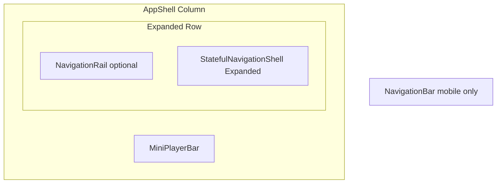

# Responsive App Shell

The shell is the **layout skeleton** every screen shares:



**Layout controls used:** `Column`, `Row`, `Expanded`, `NavigationRail`, `VerticalDivider`, `NavigationBar`, `SafeArea`.

## AppShell

```dart
import 'package:flutter/material.dart';
import 'package:go_router/go_router.dart';

import 'mini_player_bar.dart';
import 'side_nav_rail.dart';

class AppShell extends StatelessWidget {
  const AppShell({super.key, required this.navigationShell});

  final StatefulNavigationShell navigationShell;

  static const _wideBreakpoint = 900.0;

  @override
  Widget build(BuildContext context) {
    final wide = MediaQuery.sizeOf(context).width >= _wideBreakpoint;

    return Scaffold(
      body: SafeArea(
        child: Column(
          children: [
            Expanded(
              child: Row(
                children: [
                  if (wide)
                    SideNavRail(
                      selectedIndex: navigationShell.currentIndex,
                      onDestinationSelected: _goBranch,
                    ),
                  if (wide) const VerticalDivider(width: 1, thickness: 1),
                  Expanded(child: navigationShell),
                ],
              ),
            ),
            const MiniPlayerBar(),
          ],
        ),
      ),
      bottomNavigationBar: wide
          ? null
          : NavigationBar(
              selectedIndex: navigationShell.currentIndex,
              onDestinationSelected: _goBranch,
              destinations: const [
                NavigationDestination(
                  icon: Icon(Icons.home_outlined),
                  selectedIcon: Icon(Icons.home),
                  label: 'Home',
                ),
                NavigationDestination(
                  icon: Icon(Icons.search_outlined),
                  selectedIcon: Icon(Icons.search),
                  label: 'Search',
                ),
                NavigationDestination(
                  icon: Icon(Icons.library_music_outlined),
                  selectedIcon: Icon(Icons.library_music),
                  label: 'Library',
                ),
              ],
            ),
    );
  }

  void _goBranch(int index) {
    navigationShell.goBranch(
      index,
      initialLocation: index == navigationShell.currentIndex,
    );
  }
}
```

### Why Column + Expanded?

- **`Column`** stacks **main content** above **mini player**.
- **`Expanded`** around the `Row` gives the tab body all vertical space minus the mini player height.
- Without `Expanded`, the inner `ListView` / `CustomScrollView` would get **unbounded height** errors.

## SideNavRail (desktop)

Uses **`NavigationRail`** + **`LayoutBuilder`** optional extension:

```dart
class SideNavRail extends StatelessWidget {
  const SideNavRail({
    super.key,
    required this.selectedIndex,
    required this.onDestinationSelected,
  });

  final int selectedIndex;
  final ValueChanged<int> onDestinationSelected;

  @override
  Widget build(BuildContext context) {
    return LayoutBuilder(
      builder: (context, constraints) {
        final extended = constraints.maxHeight > 500;
        return NavigationRail(
          extended: extended,
          minExtendedWidth: 180,
          selectedIndex: selectedIndex,
          onDestinationSelected: onDestinationSelected,
          labelType: NavigationRailLabelType.all,
          destinations: const [
            NavigationRailDestination(
              icon: Icon(Icons.home_outlined),
              selectedIcon: Icon(Icons.home),
              label: Text('Home'),
            ),
            NavigationRailDestination(
              icon: Icon(Icons.search_outlined),
              selectedIcon: Icon(Icons.search),
              label: Text('Search'),
            ),
            NavigationRailDestination(
              icon: Icon(Icons.library_music_outlined),
              selectedIcon: Icon(Icons.library_music),
              label: Text('Library'),
            ),
          ],
        );
      },
    );
  }
}
```

## MiniPlayerBar — Row + InkWell + navigation

Combines **`Material`**, **`InkWell`**, **`Row`**, **`Expanded`**, **`ClipRRect`**, **`IconButton`**:

```dart
import 'package:cached_network_image/cached_network_image.dart';
import 'package:flutter/material.dart';
import 'package:go_router/go_router.dart';
import 'package:provider/provider.dart';

import '../../data/repositories/audio_repository.dart';

class MiniPlayerBar extends StatelessWidget {
  const MiniPlayerBar({super.key});

  @override
  Widget build(BuildContext context) {
    final audio = context.watch<AudioRepository>();
    final track = audio.current;
    if (track == null) return const SizedBox.shrink();

    final colorScheme = Theme.of(context).colorScheme;

    return Material(
      elevation: 8,
      color: colorScheme.surfaceContainerHigh,
      child: InkWell(
        onTap: () => context.push('/now-playing'),
        child: SizedBox(
          height: 64,
          child: Row(
            children: [
              const SizedBox(width: 12),
              ClipRRect(
                borderRadius: BorderRadius.circular(4),
                child: CachedNetworkImage(
                  imageUrl: track.artUrl ?? '',
                  width: 48,
                  height: 48,
                  fit: BoxFit.cover,
                  errorWidget: (_, __, ___) => const Icon(Icons.album, size: 48),
                ),
              ),
              const SizedBox(width: 12),
              Expanded(
                child: Column(
                  mainAxisAlignment: MainAxisAlignment.center,
                  crossAxisAlignment: CrossAxisAlignment.start,
                  children: [
                    Text(track.title, maxLines: 1, overflow: TextOverflow.ellipsis),
                    Text(
                      track.artist,
                      maxLines: 1,
                      overflow: TextOverflow.ellipsis,
                      style: Theme.of(context).textTheme.bodySmall,
                    ),
                  ],
                ),
              ),
              IconButton(
                icon: Icon(audio.isPlaying ? Icons.pause : Icons.play_arrow),
                onPressed: () => audio.togglePlayPause(),
              ),
              IconButton(
                icon: const Icon(Icons.skip_next),
                onPressed: () => audio.skipNext(),
              ),
              const SizedBox(width: 4),
            ],
          ),
        ),
      ),
    );
  }
}
```

| Widget | Role in mini player |
|--------|---------------------|
| `SizedBox(height: 64)` | Fixed bar height |
| `Row` + `Expanded` | Title column takes remaining width |
| `InkWell` | Tap opens full player |
| `IconButton` | Play/pause without opening full screen |

## Padding for bottom inset

On mobile, account for **home indicator** and **NavigationBar**:

```dart
// Inside each tab root screen:
padding: EdgeInsets.only(bottom: kBottomNavigationBarHeight),
```

Or let `SafeArea` on shell handle bottom — ensure scroll views use `padding` so last list item is not hidden behind the mini player (`padding: EdgeInsets.only(bottom: 72)` on sliver lists).


<!-- enriched:v3 -->

## Scenario

Mini player had to survive tab switches without resetting queue.

## Deep dive

Shell Column stacks content + player; StatefulShellRoute keeps tab stacks alive.

## Extended example

```dart
Column(
  children: [
    Expanded(child: navigationShell),
    const MiniPlayerBar(),
  ],
);
```

## Refined UI note

Reserve bottom padding in scroll views so last row clears mini player.

## Try it

- Breakpoint test rail vs bar.
- Add desktop extended rail.

## Summary

**`AppShell`** uses a **`Column`** with an **`Expanded` `Row`**: optional **`NavigationRail`**, tab content, then **`MiniPlayerBar`**. Mobile adds **`NavigationBar`**. This layout keeps playback visible while users switch home, search, and library.
