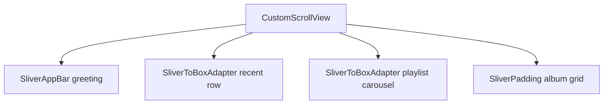

# Home Screen

The home experience greets the user, surfaces **recent albums**, **playlist carousels**, and a **grid of recommendations**. One **`CustomScrollView`** with multiple **slivers** keeps scrolling unified (Part 8) while mixing horizontal **`ListView`** sections and a vertical **`SliverGrid`**.

## Layout overview



| Section | Layout / UI widgets |
|---------|---------------------|
| Header | `SliverAppBar` or `SliverToBoxAdapter` + `Text` |
| Recent | `SizedBox` + horizontal `ListView.separated` |
| Playlists | `Row` section title + horizontal `ListView` |
| Albums | `SliverGrid` with `AlbumCard` |

## HomeScreen implementation

```dart
import 'package:flutter/material.dart';
import 'package:go_router/go_router.dart';
import 'package:provider/provider.dart';

import '../../data/repositories/catalog_repository.dart';
import '../../shared/widgets/album_card.dart';
import '../../shared/widgets/playlist_card.dart';
import '../../shared/widgets/section_header.dart';

class HomeScreen extends StatelessWidget {
  const HomeScreen({super.key});

  @override
  Widget build(BuildContext context) {
    final catalog = context.watch<CatalogRepository>();
    final albums = catalog.albums;
    final playlists = catalog.playlists;
    final hour = DateTime.now().hour;
    final greeting = hour < 12 ? 'Good morning' : hour < 17 ? 'Good afternoon' : 'Good evening';

    return CustomScrollView(
      slivers: [
        SliverAppBar(
          floating: true,
          snap: true,
          title: Text(greeting),
          actions: [
            IconButton(icon: const Icon(Icons.notifications_outlined), onPressed: () {}),
            IconButton(icon: const Icon(Icons.history), onPressed: () {}),
            const SizedBox(width: 8),
          ],
        ),
        SliverToBoxAdapter(
          child: SectionHeader(
            title: 'Recently played',
            onSeeAll: () => context.go('/library'),
          ),
        ),
        SliverToBoxAdapter(
          child: SizedBox(
            height: 180,
            child: ListView.separated(
              padding: const EdgeInsets.symmetric(horizontal: 16),
              scrollDirection: Axis.horizontal,
              itemCount: albums.length.clamp(0, 8),
              separatorBuilder: (_, __) => const SizedBox(width: 12),
              itemBuilder: (context, index) {
                final album = albums[index];
                return AlbumCard(
                  album: album,
                  width: 140,
                  onTap: () => context.push('/album/${album.id}'),
                );
              },
            ),
          ),
        ),
        SliverToBoxAdapter(
          child: SectionHeader(title: 'Made for you'),
        ),
        SliverToBoxAdapter(
          child: SizedBox(
            height: 200,
            child: ListView.separated(
              padding: const EdgeInsets.symmetric(horizontal: 16),
              scrollDirection: Axis.horizontal,
              itemCount: playlists.length,
              separatorBuilder: (_, __) => const SizedBox(width: 12),
              itemBuilder: (context, index) {
                final p = playlists[index];
                return PlaylistCard(
                  playlist: p,
                  onTap: () => context.push('/playlist/${p.id}'),
                );
              },
            ),
          ),
        ),
        SliverToBoxAdapter(child: SectionHeader(title: 'Albums for you')),
        SliverPadding(
          padding: const EdgeInsets.fromLTRB(16, 0, 16, 100),
          sliver: SliverLayoutBuilder(
            builder: (context, constraints) {
              final crossCount = constraints.crossAxisExtent > 700 ? 4 : 2;
              return SliverGrid(
                gridDelegate: SliverGridDelegateWithFixedCrossAxisCount(
                  crossAxisCount: crossCount,
                  mainAxisSpacing: 12,
                  crossAxisSpacing: 12,
                  childAspectRatio: 0.72,
                ),
                delegate: SliverChildBuilderDelegate(
                  (context, index) {
                    final album = albums[index];
                    return AlbumCard(
                      album: album,
                      showTitleBelow: true,
                      onTap: () => context.push('/album/${album.id}'),
                    );
                  },
                  childCount: albums.length,
                ),
              );
            },
          ),
        ),
      ],
    );
  }
}
```

### SectionHeader — Row + TextButton

```dart
class SectionHeader extends StatelessWidget {
  const SectionHeader({super.key, required this.title, this.onSeeAll});

  final String title;
  final VoidCallback? onSeeAll;

  @override
  Widget build(BuildContext context) {
    return Padding(
      padding: const EdgeInsets.fromLTRB(16, 24, 8, 12),
      child: Row(
        children: [
          Expanded(
            child: Text(title, style: Theme.of(context).textTheme.titleLarge),
          ),
          if (onSeeAll != null)
            TextButton(onPressed: onSeeAll, child: const Text('See all')),
        ],
      ),
    );
  }
}
```

### AlbumCard — Column + Stack optional badge

```dart
class AlbumCard extends StatelessWidget {
  const AlbumCard({
    super.key,
    required this.album,
    this.width,
    this.showTitleBelow = false,
    required this.onTap,
  });

  final Album album;
  final double? width;
  final bool showTitleBelow;
  final VoidCallback onTap;

  @override
  Widget build(BuildContext context) {
    final image = ClipRRect(
      borderRadius: BorderRadius.circular(8),
      child: AspectRatio(
        aspectRatio: 1,
        child: Image.network(album.coverUrl, fit: BoxFit.cover),
      ),
    );

    return SizedBox(
      width: width,
      child: InkWell(
        onTap: onTap,
        borderRadius: BorderRadius.circular(8),
        child: Column(
          crossAxisAlignment: CrossAxisAlignment.start,
          mainAxisSize: MainAxisSize.min,
          children: [
            image,
            if (showTitleBelow) ...[
              const SizedBox(height: 8),
              Text(album.title, maxLines: 1, overflow: TextOverflow.ellipsis),
              Text(
                album.artist,
                maxLines: 1,
                overflow: TextOverflow.ellipsis,
                style: Theme.of(context).textTheme.bodySmall,
              ),
            ],
          ],
        ),
      ),
    );
  }
}
```

## Quick access chips (optional)

Add a **`Wrap`** of shortcut tiles below the greeting:

```dart
SliverToBoxAdapter(
  child: Padding(
    padding: const EdgeInsets.symmetric(horizontal: 16),
    child: Wrap(
      spacing: 8,
      runSpacing: 8,
      children: [
        _HomeChip(label: 'Liked Songs', icon: Icons.favorite, onTap: () {}),
        _HomeChip(label: 'Episodes', icon: Icons.podcasts, onTap: () {}),
        _HomeChip(label: 'Downloads', icon: Icons.download, onTap: () {}),
      ],
    ),
  ),
),
```

```dart
class _HomeChip extends StatelessWidget {
  const _HomeChip({required this.label, required this.icon, required this.onTap});
  final String label;
  final IconData icon;
  final VoidCallback onTap;

  @override
  Widget build(BuildContext context) {
    return Material(
      color: Theme.of(context).colorScheme.surfaceContainerHighest,
      borderRadius: BorderRadius.circular(24),
      child: InkWell(
        onTap: onTap,
        borderRadius: BorderRadius.circular(24),
        child: Padding(
          padding: const EdgeInsets.symmetric(horizontal: 16, vertical: 10),
          child: Row(
            mainAxisSize: MainAxisSize.min,
            children: [
              Icon(icon, size: 20),
              const SizedBox(width: 8),
              Text(label),
            ],
          ),
        ),
      ),
    );
  }
}
```

## Summary

Home combines **`CustomScrollView`**, **`SliverAppBar`**, horizontal **`ListView`** carousels (`SizedBox` height + `Axis.horizontal`), and **`SliverGrid`** for album walls. **`SectionHeader`** uses **`Row`** + **`Expanded`** + **`TextButton`**. Every card navigates with **`context.push`** to album or playlist routes.
