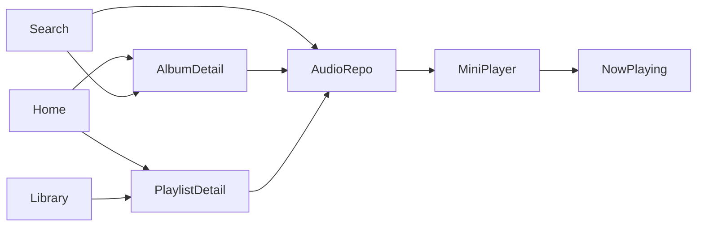

# Library and Playlists

The **library** tab lists user playlists, liked songs, and saved albums. **Playlist detail** mirrors album pages but shows playlist description and the same track **`SliverList`**. This chapter ties **`ListView`**, **`TabBar`**, **`FilterChip`**, and playlist **`playTracks`** together.

## Library screen with filter chips

```dart
import 'package:flutter/material.dart';
import 'package:go_router/go_router.dart';
import 'package:provider/provider.dart';

import '../../data/repositories/catalog_repository.dart';

enum LibraryFilter { playlists, albums, artists }

class LibraryScreen extends StatefulWidget {
  const LibraryScreen({super.key});

  @override
  State<LibraryScreen> createState() => _LibraryScreenState();
}

class _LibraryScreenState extends State<LibraryScreen> {
  LibraryFilter _filter = LibraryFilter.playlists;

  @override
  Widget build(BuildContext context) {
    final catalog = context.watch<CatalogRepository>();

    return Column(
      crossAxisAlignment: CrossAxisAlignment.stretch,
      children: [
        Padding(
          padding: const EdgeInsets.fromLTRB(16, 16, 16, 8),
          child: Row(
            children: [
              Expanded(
                child: Text('Your Library', style: Theme.of(context).textTheme.headlineSmall),
              ),
              IconButton(icon: const Icon(Icons.search), onPressed: () => context.go('/search')),
              IconButton(icon: const Icon(Icons.add), onPressed: _createPlaylist),
            ],
          ),
        ),
        SingleChildScrollView(
          scrollDirection: Axis.horizontal,
          padding: const EdgeInsets.symmetric(horizontal: 16),
          child: Row(
            children: [
              FilterChip(
                label: const Text('Playlists'),
                selected: _filter == LibraryFilter.playlists,
                onSelected: (_) => setState(() => _filter = LibraryFilter.playlists),
              ),
              const SizedBox(width: 8),
              FilterChip(
                label: const Text('Albums'),
                selected: _filter == LibraryFilter.albums,
                onSelected: (_) => setState(() => _filter = LibraryFilter.albums),
              ),
              const SizedBox(width: 8),
              FilterChip(
                label: const Text('Artists'),
                selected: _filter == LibraryFilter.artists,
                onSelected: (_) => setState(() => _filter = LibraryFilter.artists),
              ),
            ],
          ),
        ),
        const SizedBox(height: 8),
        Expanded(child: _buildBody(context, catalog)),
      ],
    );
  }

  Widget _buildBody(BuildContext context, CatalogRepository catalog) {
    switch (_filter) {
      case LibraryFilter.playlists:
        return _PlaylistList(playlists: catalog.playlists);
      case LibraryFilter.albums:
        return _AlbumLibraryList(albums: catalog.albums);
      case LibraryFilter.artists:
        return _ArtistPlaceholder();
    }
  }

  void _createPlaylist() {
    showDialog(
      context: context,
      builder: (context) => AlertDialog(
        title: const Text('Create playlist'),
        content: const TextField(decoration: InputDecoration(labelText: 'Name')),
        actions: [
          TextButton(onPressed: () => Navigator.pop(context), child: const Text('Cancel')),
          FilledButton(onPressed: () => Navigator.pop(context), child: const Text('Create')),
        ],
      ),
    );
  }
}
```

| Control | Role |
|---------|------|
| `Column` + `Expanded` | Chip row + scrollable list |
| `FilterChip` | Switch library segment |
| `AlertDialog` + `TextField` | Create playlist |
| `IconButton` | Jump to search |

## Playlist list

```dart
class _PlaylistList extends StatelessWidget {
  const _PlaylistList({required this.playlists});

  final List<Playlist> playlists;

  @override
  Widget build(BuildContext context) {
    return ListView.separated(
      padding: const EdgeInsets.only(bottom: 100),
      itemCount: playlists.length + 1,
      separatorBuilder: (_, __) => const SizedBox(height: 4),
      itemBuilder: (context, index) {
        if (index == 0) {
          return ListTile(
            leading: Container(
              width: 56,
              height: 56,
              color: Theme.of(context).colorScheme.primaryContainer,
              child: const Icon(Icons.favorite),
            ),
            title: const Text('Liked Songs'),
            subtitle: const Text('Playlist · 128 tracks'),
            onTap: () {},
          );
        }
        final playlist = playlists[index - 1];
        return ListTile(
          leading: ClipRRect(
            borderRadius: BorderRadius.circular(4),
            child: Image.network(playlist.coverUrl, width: 56, height: 56, fit: BoxFit.cover),
          ),
          title: Text(playlist.title),
          subtitle: Text('Playlist · ${playlist.trackIds.length} tracks'),
          onTap: () => context.push('/playlist/${playlist.id}'),
        );
      },
    );
  }
}
```

## Playlist detail screen

Same structure as album detail — **`CustomScrollView`**, header, play row, track list:

```dart
class PlaylistDetailScreen extends StatelessWidget {
  const PlaylistDetailScreen({super.key, required this.playlistId});

  final String playlistId;

  @override
  Widget build(BuildContext context) {
    final catalog = context.read<CatalogRepository>();
    final playlist = catalog.playlistById(playlistId);
    if (playlist == null) {
      return const Scaffold(body: Center(child: Text('Playlist not found')));
    }
    final tracks = catalog.tracksForPlaylist(playlistId);

    return Scaffold(
      body: CustomScrollView(
        slivers: [
          SliverAppBar(
            expandedHeight: 240,
            pinned: true,
            flexibleSpace: FlexibleSpaceBar(
              title: Text(playlist.title),
              background: Stack(
                fit: StackFit.expand,
                children: [
                  Image.network(playlist.coverUrl, fit: BoxFit.cover),
                  DecoratedBox(
                    decoration: BoxDecoration(
                      gradient: LinearGradient(
                        begin: Alignment.topCenter,
                        end: Alignment.bottomCenter,
                        colors: [Colors.transparent, Colors.black.withValues(alpha: 0.9)],
                      ),
                    ),
                  ),
                ],
              ),
            ),
          ),
          SliverToBoxAdapter(
            child: Padding(
              padding: const EdgeInsets.all(16),
              child: Column(
                crossAxisAlignment: CrossAxisAlignment.start,
                children: [
                  Text(playlist.description),
                  const SizedBox(height: 8),
                  Text('${tracks.length} songs', style: Theme.of(context).textTheme.bodySmall),
                  const SizedBox(height: 16),
                  Row(
                    children: [
                      FilledButton.icon(
                        onPressed: () {
                          context.read<AudioRepository>().playTracks(tracks);
                        },
                        icon: const Icon(Icons.play_arrow),
                        label: const Text('Play'),
                      ),
                      const SizedBox(width: 12),
                      OutlinedButton.icon(
                        onPressed: () {},
                        icon: const Icon(Icons.shuffle),
                        label: const Text('Shuffle'),
                      ),
                    ],
                  ),
                ],
              ),
            ),
          ),
          SliverList.builder(
            itemCount: tracks.length,
            itemBuilder: (context, index) {
              final track = tracks[index];
              return Dismissible(
                key: ValueKey(track.id),
                direction: DismissDirection.endToStart,
                background: Container(
                  color: Theme.of(context).colorScheme.error,
                  alignment: Alignment.centerRight,
                  padding: const EdgeInsets.only(right: 16),
                  child: const Icon(Icons.remove_circle_outline, color: Colors.white),
                ),
                confirmDismiss: (_) async {
                  return await showDialog<bool>(
                        context: context,
                        builder: (context) => AlertDialog(
                          title: const Text('Remove from playlist?'),
                          actions: [
                            TextButton(onPressed: () => Navigator.pop(context, false), child: const Text('Cancel')),
                            FilledButton(onPressed: () => Navigator.pop(context, true), child: const Text('Remove')),
                          ],
                        ),
                      ) ??
                      false;
                },
                onDismissed: (_) {
                  // Remove track id from playlist in repository
                },
                child: TrackListTile(
                  track: track,
                  index: index,
                  onTap: () => context.read<AudioRepository>().playTracks(tracks, startIndex: index),
                ),
              );
            },
          ),
          const SliverPadding(padding: EdgeInsets.only(bottom: 120)),
        ],
      ),
    );
  }
}
```

**`Dismissible`** + **`AlertDialog`** demonstrate swipe-to-remove with confirmation (Part 10).

## Liked songs — simple track list

```dart
class LikedSongsScreen extends StatelessWidget {
  const LikedSongsScreen({super.key, required this.tracks});

  final List<Track> tracks;

  @override
  Widget build(BuildContext context) {
    return Scaffold(
      appBar: AppBar(title: const Text('Liked Songs')),
      body: ListView.builder(
        padding: const EdgeInsets.only(bottom: 96),
        itemCount: tracks.length,
        itemBuilder: (context, index) {
          final track = tracks[index];
          return TrackListTile(
            track: track,
            index: index,
            onTap: () => context.read<AudioRepository>().playTracks(tracks, startIndex: index),
          );
        },
      ),
    );
  }
}
```

## End-to-end feature map



| Screen | Primary layouts | Primary controls |
|--------|-----------------|----------------|
| Home | `CustomScrollView`, horizontal `ListView`, `SliverGrid` | `SliverAppBar`, `InkWell`, cards |
| Search | `Column`, `GridView`, `ListView` | `TextField`, `ListTile`, sheets |
| Library | `Column`, `ListView`, chips | `FilterChip`, `ListTile`, dialog |
| Album / playlist | `CustomScrollView`, `SliverAppBar` | `FilledButton`, `SliverList`, `Dismissible` |
| Player | `Stack`, `Column` | `Slider`, `IconButton`, reorderable queue |

## Summary

**Library** filters with **`FilterChip`** and lists playlists/albums via **`ListView`**. **Playlist detail** reuses the album **sliver** pattern and connects tracks to **`AudioRepository`**. Together with home, search, album, and shell chapters, Melody Hub is a **complete** multi-screen music UI you can extend with real URLs, auth, and persistence.
